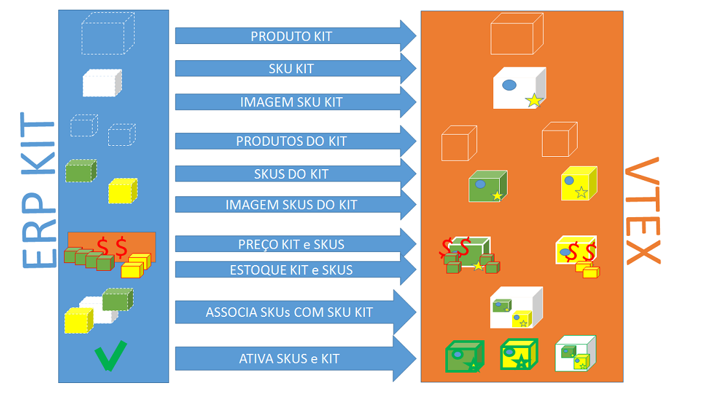

# ERP - Integração de KIT

Este documento tem por objetivo auxiliar o integrador na integração de KIT, do ERP para uma loja hospedada na versão smartcheckout da VTEX.

## 1 KIT##
Um KIT no sistema VTEX é uma SKU como outra qualquer, só que nesse caso existem outras SKUS realcionadas a SKU do tipo KIT. Uma vez uma SKU marcada como KIT no sistema VTEX, ela sempre será KIT, pois não como reverter um KIT. Para Cadastra um KIT é necessa´rio seguir os seguintes fluxos:

 

###1.1 Cadastrar o Produto KIT:###

_request:_

	<soapenv:Envelope xmlns:soapenv="http://schemas.xmlsoap.org/soap/envelope/" xmlns:tem="http://tempuri.org/" xmlns:vtex="http://schemas.datacontract.org/2004/07/Vtex.Commerce.WebApps.AdminWcfService.Contracts" xmlns:arr="http://schemas.microsoft.com/2003/10/Serialization/Arrays">
	   <soapenv:Header/>
	   <soapenv:Body>
	      <tem:ProductInsertUpdate>
	         <tem:productVO>
	            <vtex:BrandId>2000011</vtex:BrandId>
	            <vtex:CategoryId>1000020</vtex:CategoryId>
	            <vtex:DepartmentId>1000018</vtex:DepartmentId>
	            <vtex:Description>Pa e rastelo para jardinagem</vtex:Description>
	            <vtex:DescriptionShort>Pa e rastelo para jardinagem</vtex:DescriptionShort>
	            <vtex:IsActive>true</vtex:IsActive>
	            <vtex:IsVisible>true</vtex:IsVisible>
	            <vtex:KeyWords>pa rastelo</vtex:KeyWords>
	            <vtex:ListStoreId>
	               <arr:int>1</arr:int>
	            </vtex:ListStoreId>
	            <vtex:MetaTagDescription>Pa e rastelo para jardinagem</vtex:MetaTagDescription>
	            <vtex:Name>Kit pa e rastelo</vtex:Name>
	             <vtex:RefId>2234567890</vtex:RefId>
	            <vtex:Title>Kit pa e rastelo</vtex:Title>
	         </tem:productVO>
	      </tem:ProductInsertUpdate>
	   </soapenv:Body>
	</soapenv:Envelope>

_response:_

	<s:Envelope xmlns:s="http://schemas.xmlsoap.org/soap/envelope/">
	   <s:Body>
	      <ProductInsertUpdateResponse xmlns="http://tempuri.org/">
	         <ProductInsertUpdateResult xmlns:a="http://schemas.datacontract.org/2004/07/Vtex.Commerce.WebApps.AdminWcfService.Contracts" xmlns:i="http://www.w3.org/2001/XMLSchema-instance">
	            <a:AdWordsRemarketingCode i:nil="true"/>
	            <a:BrandId>2000011</a:BrandId>
	            <a:CategoryId>1000020</a:CategoryId>
	            <a:DepartmentId>1000018</a:DepartmentId>
	            <a:Description>Pa e rastelo para jardinagem</a:Description>
	            <a:DescriptionShort>Pa e rastelo para jardinagem</a:DescriptionShort>
	            <a:Id>31018370</a:Id>
	            <a:IsActive>false</a:IsActive>
	            <a:IsVisible>true</a:IsVisible>
	            <a:KeyWords>pa rastelo</a:KeyWords>
	            <a:LinkId>Kit-pa-e-rastelo</a:LinkId>
	            <a:ListStoreId xmlns:b="http://schemas.microsoft.com/2003/10/Serialization/Arrays">
	               <b:int>1</b:int>
	            </a:ListStoreId>
	            <a:LomadeeCampaignCode i:nil="true"/>
	            <a:MetaTagDescription>Pa e rastelo para jardinagem</a:MetaTagDescription>
	            <a:Name>Kit pa e rastelo</a:Name>
	            <a:RefId>2234567890</a:RefId>
	            <a:ReleaseDate i:nil="true"/>
	            <a:ShowWithoutStock>true</a:ShowWithoutStock>
	            <a:SupplierId i:nil="true"/>
	            <a:TaxCode i:nil="true"/>
	            <a:Title>Kit pa e rastelo</a:Title>
	         </ProductInsertUpdateResult>
	      </ProductInsertUpdateResponse>
	   </s:Body>
	</s:Envelope>

###1.2 Cadastrar a SKU KIT###

	_request:_  
	
		<soapenv:Envelope xmlns:soapenv="http://schemas.xmlsoap.org/soap/envelope/" xmlns:tem="http://tempuri.org/" xmlns:vtex="http://schemas.datacontract.org/2004/07/Vtex.Commerce.WebApps.AdminWcfService.Contracts">
	   <soapenv:Header/>
	   <soapenv:Body>
	      <tem:StockKeepingUnitInsertUpdate>
	         <tem:stockKeepingUnitVO>
	            <vtex:CubicWeight>100</vtex:CubicWeight>
	            <vtex:Height>15</vtex:Height>
	            <vtex:IsActive>true</vtex:IsActive>
	            <vtex:IsAvaiable>true</vtex:IsAvaiable>
	            <vtex:IsKit>true</vtex:IsKit> //define que essa SKU, será um KIT - irreversível
	            <vtex:Length>15</vtex:Length>
		        <vtex:ListPrice>50.0</vtex:ListPrice> //define o preço DE do KIT
	            <vtex:ModalId>1</vtex:ModalId>
	            <vtex:Name>SKU do KIT</vtex:Name>
		        <vtex:Price>40.0</vtex:Price> //define o preço POR do KIT
	            <vtex:ProductId>31018370</vtex:ProductId>
	            <vtex:RealHeight>17</vtex:RealHeight>
	            <vtex:RealLength>17</vtex:RealLength>
	            <vtex:RealWeightKg>10</vtex:RealWeightKg>
	            <vtex:RealWidth>17</vtex:RealWidth>
	            <vtex:RefId>30123456</vtex:RefId>
	            <vtex:RewardValue>0</vtex:RewardValue>
	            <vtex:StockKeepingUnitEans>
	               <vtex:StockKeepingUnitEanDTO>
	                  <vtex:Ean>3123456789123</vtex:Ean>
	               </vtex:StockKeepingUnitEanDTO>
	            </vtex:StockKeepingUnitEans>
	            <vtex:UnitMultiplier>1</vtex:UnitMultiplier>
	            <vtex:WeightKg>9</vtex:WeightKg>
	            <vtex:Width>15</vtex:Width>
	         </tem:stockKeepingUnitVO>
	      </tem:StockKeepingUnitInsertUpdate>
	   </soapenv:Body>
	</soapenv:Envelope>

_response:_

	<s:Envelope xmlns:s="http://schemas.xmlsoap.org/soap/envelope/">
	   <s:Body>
	      <StockKeepingUnitInsertUpdateResponse xmlns="http://tempuri.org/">
	         <StockKeepingUnitInsertUpdateResult xmlns:a="http://schemas.datacontract.org/2004/07/Vtex.Commerce.WebApps.AdminWcfService.Contracts" xmlns:i="http://www.w3.org/2001/XMLSchema-instance">
	            <a:CommercialConditionId>1</a:CommercialConditionId>
	            <a:CostPrice>1.0000</a:CostPrice>
	            <a:CubicWeight>100</a:CubicWeight>
	            <a:DateUpdated>2014-11-03T13:58:10.3061928</a:DateUpdated>
	            <a:EstimatedDateArrival i:nil="true"/>
	            <a:Height>15</a:Height>
	            <a:Id>31018373</a:Id>
	            <a:InternalNote i:nil="true"/>
	            <a:IsActive>false</a:IsActive>
	            <a:IsAvaiable>false</a:IsAvaiable>
	            <a:IsKit>true</a:IsKit>
	            <a:Length>15</a:Length>
	            <a:ListPrice>50.0</a:ListPrice>
	            <a:ManufacturerCode i:nil="true"/>
	            <a:MeasurementUnit>un</a:MeasurementUnit>
	            <a:ModalId>1</a:ModalId>
	            <a:ModalType i:nil="true"/>
	            <a:Name>SKU do KIT</a:Name>
	            <a:Price>40.0</a:Price>
	            <a:ProductId>31018370</a:ProductId>
	            <a:ProductName>Kit pa e rastelo</a:ProductName>
	            <a:RealHeight>17</a:RealHeight>
	            <a:RealLength>17</a:RealLength>
	            <a:RealWeightKg>10</a:RealWeightKg>
	            <a:RealWidth>17</a:RealWidth>
	            <a:RefId>30123456</a:RefId>
	            <a:RewardValue>0</a:RewardValue>
	            <a:StockKeepingUnitEans>
	               <a:StockKeepingUnitEanDTO>
	                  <a:Ean>3123456789123</a:Ean>
	               </a:StockKeepingUnitEanDTO>
	            </a:StockKeepingUnitEans>
	            <a:UnitMultiplier>1</a:UnitMultiplier>
	            <a:WeightKg>9</a:WeightKg>
	            <a:Width>15</a:Width>
	         </StockKeepingUnitInsertUpdateResult>
	      </StockKeepingUnitInsertUpdateResponse>
	   </s:Body>
	</s:Envelope>

###1.3 Cadastrar a Imagem do SKU KIT###

_request:_

	<soapenv:Envelope xmlns:soapenv="http://schemas.xmlsoap.org/soap/envelope/" xmlns:tem="http://tempuri.org/">
	   <soapenv:Header/>
	   <soapenv:Body>
	      <tem:ImageServiceInsertUpdate>
	         <tem:urlImage>http://img.ph2-jpg.posthaus.com.br/Web/posthaus/foto/brinquedos/jogos-e-outros-brinquedos/brinquedo-pa-e-rastelo_56855_600_1.jpg</tem:urlImage>
	         <tem:imageName>Pa_Rastelo</tem:imageName>
	         <tem:stockKeepingUnitId>31018373</tem:stockKeepingUnitId>
	          <tem:fileId>31018373</tem:fileId>
	      </tem:ImageServiceInsertUpdate>
	   </soapenv:Body>
	</soapenv:Envelope>

_response:_

	<s:Envelope xmlns:s="http://schemas.xmlsoap.org/soap/envelope/">
	   <s:Body>
	      <ImageServiceInsertUpdateResponse xmlns="http://tempuri.org/"/>
	   </s:Body>
	</s:Envelope>

###1.4 Cadastrar os PRODUTOS (pai da SKUS) do KIT###

_request:_

	<soapenv:Envelope xmlns:soapenv="http://schemas.xmlsoap.org/soap/envelope/" xmlns:tem="http://tempuri.org/" xmlns:vtex="http://schemas.datacontract.org/2004/07/Vtex.Commerce.WebApps.AdminWcfService.Contracts" xmlns:arr="http://schemas.microsoft.com/2003/10/Serialization/Arrays">
	   <soapenv:Header/>
	   <soapenv:Body>
	      <tem:ProductInsertUpdate>
	         <tem:productVO>
	            <vtex:BrandId>2000011</vtex:BrandId>
	            <vtex:CategoryId>1000020</vtex:CategoryId>
	            <vtex:DepartmentId>1000018</vtex:DepartmentId>
	            <vtex:Description>Pa</vtex:Description>
	            <vtex:DescriptionShort>Pa de jardim</vtex:DescriptionShort>
	            <vtex:IsActive>true</vtex:IsActive>
	            <vtex:IsVisible>false</vtex:IsVisible>
	            <vtex:KeyWords>Pa de jardim</vtex:KeyWords>
	            <vtex:LinkId>pa_jardim</vtex:LinkId>
	            <vtex:ListStoreId>
	               <arr:int>1</arr:int>
	            </vtex:ListStoreId>
	            <vtex:MetaTagDescription>Pa de jardim</vtex:MetaTagDescription>
	            <vtex:Name>Pa de jardim</vtex:Name>
	             <vtex:RefId>5234567891</vtex:RefId>
	            <vtex:Title>Pa de jardim</vtex:Title>
	         </tem:productVO>
	      </tem:ProductInsertUpdate>
	   </soapenv:Body>
	</soapenv:Envelope>

_response:_

	<s:Envelope xmlns:s="http://schemas.xmlsoap.org/soap/envelope/">
	   <s:Body>
	      <ProductInsertUpdateResponse xmlns="http://tempuri.org/">
	         <ProductInsertUpdateResult xmlns:a="http://schemas.datacontract.org/2004/07/Vtex.Commerce.WebApps.AdminWcfService.Contracts" xmlns:i="http://www.w3.org/2001/XMLSchema-instance">
	            <a:AdWordsRemarketingCode i:nil="true"/>
	            <a:BrandId>2000011</a:BrandId>
	            <a:CategoryId>1000020</a:CategoryId>
	            <a:DepartmentId>1000018</a:DepartmentId>
	            <a:Description>Pa</a:Description>
	            <a:DescriptionShort>Pa de jardim</a:DescriptionShort>
	            <a:Id>31018371</a:Id>
	            <a:IsActive>false</a:IsActive>
	            <a:IsVisible>false</a:IsVisible>
	            <a:KeyWords>Pa de jardim</a:KeyWords>
	            <a:LinkId>pa_jardim</a:LinkId>
	            <a:ListStoreId xmlns:b="http://schemas.microsoft.com/2003/10/Serialization/Arrays">
	               <b:int>1</b:int>
	            </a:ListStoreId>
	            <a:LomadeeCampaignCode i:nil="true"/>
	            <a:MetaTagDescription>Pa de jardim</a:MetaTagDescription>
	            <a:Name>Pa de jardim</a:Name>
	            <a:RefId>5234567891</a:RefId>
	            <a:ReleaseDate i:nil="true"/>
	            <a:ShowWithoutStock>true</a:ShowWithoutStock>
	            <a:SupplierId i:nil="true"/>
	            <a:TaxCode i:nil="true"/>
	            <a:Title>Pa de jardim</a:Title>
	         </ProductInsertUpdateResult>
	      </ProductInsertUpdateResponse>
	   </s:Body>
	</s:Envelope>

_request 2:_

	<soapenv:Envelope xmlns:soapenv="http://schemas.xmlsoap.org/soap/envelope/" xmlns:tem="http://tempuri.org/" xmlns:vtex="http://schemas.datacontract.org/2004/07/Vtex.Commerce.WebApps.AdminWcfService.Contracts" xmlns:arr="http://schemas.microsoft.com/2003/10/Serialization/Arrays">
	   <soapenv:Header/>
	   <soapenv:Body>
	      <tem:ProductInsertUpdate>
	         <tem:productVO>
	            <vtex:BrandId>2000011</vtex:BrandId>
	            <vtex:CategoryId>1000020</vtex:CategoryId>
	            <vtex:DepartmentId>1000018</vtex:DepartmentId>
	            <vtex:Description>Rastelo</vtex:Description>
	            <vtex:DescriptionShort>Rastelo de jardim</vtex:DescriptionShort>
	            <vtex:IsActive>true</vtex:IsActive>
	            <vtex:IsVisible>false</vtex:IsVisible>
	            <vtex:KeyWords>Rastelo de jardim</vtex:KeyWords>
	            <vtex:ListStoreId>
	               <arr:int>1</arr:int>
	            </vtex:ListStoreId>
	            <vtex:MetaTagDescription>Rastelo de jardim</vtex:MetaTagDescription>
	            <vtex:Name>Rastelo de jardim</vtex:Name>
	             <vtex:RefId>6234567892</vtex:RefId>
	            <vtex:Title>Rastelo de jardim</vtex:Title>
	         </tem:productVO>
	      </tem:ProductInsertUpdate>
	   </soapenv:Body>
	</soapenv:Envelope>

_response 2:_

	<s:Envelope xmlns:s="http://schemas.xmlsoap.org/soap/envelope/">
	   <s:Body>
	      <ProductInsertUpdateResponse xmlns="http://tempuri.org/">
	         <ProductInsertUpdateResult xmlns:a="http://schemas.datacontract.org/2004/07/Vtex.Commerce.WebApps.AdminWcfService.Contracts" xmlns:i="http://www.w3.org/2001/XMLSchema-instance">
	            <a:AdWordsRemarketingCode i:nil="true"/>
	            <a:BrandId>2000011</a:BrandId>
	            <a:CategoryId>1000020</a:CategoryId>
	            <a:DepartmentId>1000018</a:DepartmentId>
	            <a:Description>Rastelo</a:Description>
	            <a:DescriptionShort>Rastelo de jardim</a:DescriptionShort>
	            <a:Id>31018372</a:Id>
	            <a:IsActive>false</a:IsActive>
	            <a:IsVisible>false</a:IsVisible>
	            <a:KeyWords>Rastelo de jardim</a:KeyWords>
	            <a:LinkId>Rastelo-de-jardim</a:LinkId>
	            <a:ListStoreId xmlns:b="http://schemas.microsoft.com/2003/10/Serialization/Arrays">
	               <b:int>1</b:int>
	            </a:ListStoreId>
	            <a:LomadeeCampaignCode i:nil="true"/>
	            <a:MetaTagDescription>Rastelo de jardim</a:MetaTagDescription>
	            <a:Name>Rastelo de jardim</a:Name>
	            <a:RefId>6234567892</a:RefId>
	            <a:ReleaseDate i:nil="true"/>
	            <a:ShowWithoutStock>true</a:ShowWithoutStock>
	            <a:SupplierId i:nil="true"/>
	            <a:TaxCode i:nil="true"/>
	            <a:Title>Rastelo de jardim</a:Title>
	         </ProductInsertUpdateResult>
	      </ProductInsertUpdateResponse>
	   </s:Body>
	</s:Envelope>

###1.5 Cadastrar as SKUs do KIT###

_request:_

	<soapenv:Envelope xmlns:soapenv="http://schemas.xmlsoap.org/soap/envelope/" xmlns:tem="http://tempuri.org/" xmlns:vtex="http://schemas.datacontract.org/2004/07/Vtex.Commerce.WebApps.AdminWcfService.Contracts">
	   <soapenv:Header/>
	   <soapenv:Body>
	      <tem:StockKeepingUnitInsertUpdate>
	         <tem:stockKeepingUnitVO>
	            <vtex:CubicWeight>100</vtex:CubicWeight>
	            <vtex:Height>15</vtex:Height>
	            <vtex:IsActive>true</vtex:IsActive>
	            <vtex:IsAvaiable>true</vtex:IsAvaiable>
	            <vtex:IsKit>false</vtex:IsKit>
	            <vtex:Length>15</vtex:Length>
	            <vtex:ModalId>1</vtex:ModalId>
	            <vtex:Name>Pa para jardim</vtex:Name>
	            <vtex:ProductId>31018371</vtex:ProductId>
	            <vtex:RealHeight>17</vtex:RealHeight>
	            <vtex:RealLength>17</vtex:RealLength>
	            <vtex:RealWeightKg>10</vtex:RealWeightKg>
	            <vtex:RealWidth>17</vtex:RealWidth>
	            <vtex:RefId>40123457</vtex:RefId>
	            <vtex:RewardValue>0</vtex:RewardValue>
	            <vtex:StockKeepingUnitEans>
	               <vtex:StockKeepingUnitEanDTO>
	                  <vtex:Ean>1223456789123</vtex:Ean>
	               </vtex:StockKeepingUnitEanDTO>
	            </vtex:StockKeepingUnitEans>
	            <vtex:UnitMultiplier>1</vtex:UnitMultiplier>
	            <vtex:WeightKg>1</vtex:WeightKg>
	            <vtex:Width>15</vtex:Width>
	         </tem:stockKeepingUnitVO>
	      </tem:StockKeepingUnitInsertUpdate>
	   </soapenv:Body>
	</soapenv:Envelope>

_response:_

	<s:Envelope xmlns:s="http://schemas.xmlsoap.org/soap/envelope/">
	   <s:Body>
	      <StockKeepingUnitInsertUpdateResponse xmlns="http://tempuri.org/">
	         <StockKeepingUnitInsertUpdateResult xmlns:a="http://schemas.datacontract.org/2004/07/Vtex.Commerce.WebApps.AdminWcfService.Contracts" xmlns:i="http://www.w3.org/2001/XMLSchema-instance">
	            <a:CommercialConditionId i:nil="true"/>
	            <a:CostPrice>1</a:CostPrice>
	            <a:CubicWeight>100</a:CubicWeight>
	            <a:DateUpdated>2014-11-03T14:16:52.5863835</a:DateUpdated>
	            <a:EstimatedDateArrival i:nil="true"/>
	            <a:Height>15</a:Height>
	            <a:Id>31018374</a:Id>
	            <a:InternalNote i:nil="true"/>
	            <a:IsActive>false</a:IsActive>
	            <a:IsAvaiable>false</a:IsAvaiable>
	            <a:IsKit>false</a:IsKit>
	            <a:Length>15</a:Length>
	            <a:ListPrice>99999</a:ListPrice>
	            <a:ManufacturerCode i:nil="true"/>
	            <a:MeasurementUnit>un</a:MeasurementUnit>
	            <a:ModalId>1</a:ModalId>
	            <a:ModalType i:nil="true"/>
	            <a:Name>Pa para jardim</a:Name>
	            <a:Price>99999</a:Price>
	            <a:ProductId>31018371</a:ProductId>
	            <a:ProductName>Pa de jardim</a:ProductName>
	            <a:RealHeight>17</a:RealHeight>
	            <a:RealLength>17</a:RealLength>
	            <a:RealWeightKg>10</a:RealWeightKg>
	            <a:RealWidth>17</a:RealWidth>
	            <a:RefId>40123457</a:RefId>
	            <a:RewardValue>0</a:RewardValue>
	            <a:StockKeepingUnitEans>
	               <a:StockKeepingUnitEanDTO>
	                  <a:Ean>1223456789123</a:Ean>
	               </a:StockKeepingUnitEanDTO>
	            </a:StockKeepingUnitEans>
	            <a:UnitMultiplier>1</a:UnitMultiplier>
	            <a:WeightKg>1</a:WeightKg>
	            <a:Width>15</a:Width>
	         </StockKeepingUnitInsertUpdateResult>
	      </StockKeepingUnitInsertUpdateResponse>
	   </s:Body>
	</s:Envelope>

_request 2:_

	<soapenv:Envelope xmlns:soapenv="http://schemas.xmlsoap.org/soap/envelope/" xmlns:tem="http://tempuri.org/" xmlns:vtex="http://schemas.datacontract.org/2004/07/Vtex.Commerce.WebApps.AdminWcfService.Contracts">
	   <soapenv:Header/>
	   <soapenv:Body>
	      <tem:StockKeepingUnitInsertUpdate>
	         <tem:stockKeepingUnitVO>
	            <vtex:CubicWeight>100</vtex:CubicWeight>
	            <vtex:Height>15</vtex:Height>
	            <vtex:IsActive>true</vtex:IsActive>
	            <vtex:IsAvaiable>true</vtex:IsAvaiable>
	            <vtex:IsKit>false</vtex:IsKit>
	            <vtex:Length>15</vtex:Length>
	            <vtex:ModalId>1</vtex:ModalId>
	            <vtex:Name>Rastelo para jardim</vtex:Name>
	            <vtex:ProductId>31018372</vtex:ProductId>
	            <vtex:RealHeight>17</vtex:RealHeight>
	            <vtex:RealLength>17</vtex:RealLength>
	            <vtex:RealWeightKg>10</vtex:RealWeightKg>
	            <vtex:RealWidth>17</vtex:RealWidth>
	            <vtex:RefId>51123457</vtex:RefId>
	            <vtex:RewardValue>0</vtex:RewardValue>
	            <vtex:StockKeepingUnitEans>
	               <vtex:StockKeepingUnitEanDTO>
	                  <vtex:Ean>2323456789123</vtex:Ean>
	               </vtex:StockKeepingUnitEanDTO>
	            </vtex:StockKeepingUnitEans>
	            <vtex:UnitMultiplier>1</vtex:UnitMultiplier>
	            <vtex:WeightKg>1</vtex:WeightKg>
	            <vtex:Width>15</vtex:Width>
	         </tem:stockKeepingUnitVO>
	      </tem:StockKeepingUnitInsertUpdate>
	   </soapenv:Body>
	</soapenv:Envelope>

_response 2:_

	<s:Envelope xmlns:s="http://schemas.xmlsoap.org/soap/envelope/">
	   <s:Body>
	      <StockKeepingUnitInsertUpdateResponse xmlns="http://tempuri.org/">
	         <StockKeepingUnitInsertUpdateResult xmlns:a="http://schemas.datacontract.org/2004/07/Vtex.Commerce.WebApps.AdminWcfService.Contracts" xmlns:i="http://www.w3.org/2001/XMLSchema-instance">
	            <a:CommercialConditionId i:nil="true"/>
	            <a:CostPrice>1</a:CostPrice>
	            <a:CubicWeight>100</a:CubicWeight>
	            <a:DateUpdated>2014-11-03T14:19:45.6282809</a:DateUpdated>
	            <a:EstimatedDateArrival i:nil="true"/>
	            <a:Height>15</a:Height>
	            <a:Id>31018375</a:Id>
	            <a:InternalNote i:nil="true"/>
	            <a:IsActive>false</a:IsActive>
	            <a:IsAvaiable>false</a:IsAvaiable>
	            <a:IsKit>false</a:IsKit>
	            <a:Length>15</a:Length>
	            <a:ListPrice>99999</a:ListPrice>
	            <a:ManufacturerCode i:nil="true"/>
	            <a:MeasurementUnit>un</a:MeasurementUnit>
	            <a:ModalId>1</a:ModalId>
	            <a:ModalType i:nil="true"/>
	            <a:Name>Rastelo para jardim</a:Name>
	            <a:Price>99999</a:Price>
	            <a:ProductId>31018372</a:ProductId>
	            <a:ProductName>Rastelo de jardim</a:ProductName>
	            <a:RealHeight>17</a:RealHeight>
	            <a:RealLength>17</a:RealLength>
	            <a:RealWeightKg>10</a:RealWeightKg>
	            <a:RealWidth>17</a:RealWidth>
	            <a:RefId>51123457</a:RefId>
	            <a:RewardValue>0</a:RewardValue>
	            <a:StockKeepingUnitEans>
	               <a:StockKeepingUnitEanDTO>
	                  <a:Ean>2323456789123</a:Ean>
	               </a:StockKeepingUnitEanDTO>
	            </a:StockKeepingUnitEans>
	            <a:UnitMultiplier>1</a:UnitMultiplier>
	            <a:WeightKg>1</a:WeightKg>
	            <a:Width>15</a:Width>
	         </StockKeepingUnitInsertUpdateResult>
	      </StockKeepingUnitInsertUpdateResponse>
	   </s:Body>
	</s:Envelope>

###1.6 Cadastrar as Imagens das SKUs do KIT###

_request:_

	<soapenv:Envelope xmlns:soapenv="http://schemas.xmlsoap.org/soap/envelope/" xmlns:tem="http://tempuri.org/">
	   <soapenv:Header/>
	   <soapenv:Body>
	      <tem:ImageServiceInsertUpdate>
	         <tem:urlImage>http://flicbrinquedos.com.br/media/catalog/product/cache/1/image/9df78eab33525d08d6e5fb8d27136e95/A/c/Acess_rio_Para_Jardim_-_P_-_Melissa_Doug_7_13.jpg</tem:urlImage>
	         <tem:imageName>Pa</tem:imageName>
	         <tem:stockKeepingUnitId>31018374</tem:stockKeepingUnitId>
	          <tem:fileId>31018374</tem:fileId>
	      </tem:ImageServiceInsertUpdate>
	   </soapenv:Body>
	</soapenv:Envelope>

_response:_

	<s:Envelope xmlns:s="http://schemas.xmlsoap.org/soap/envelope/">
	   <s:Body>
	      <ImageServiceInsertUpdateResponse xmlns="http://tempuri.org/"/>
	   </s:Body>
	</s:Envelope

_request 2:_

	<soapenv:Envelope xmlns:soapenv="http://schemas.xmlsoap.org/soap/envelope/" xmlns:tem="http://tempuri.org/">
	   <soapenv:Header/>
	   <soapenv:Body>
	      <tem:ImageServiceInsertUpdate>
	         <tem:urlImage>http://www.brasutil.com/loja/images/produto/1_6812.jpg</tem:urlImage>
	         <tem:imageName>Rastelo</tem:imageName>
	         <tem:stockKeepingUnitId>31018375</tem:stockKeepingUnitId>
	          <tem:fileId>31018375</tem:fileId>
	      </tem:ImageServiceInsertUpdate>
	   </soapenv:Body>
	</soapenv:Envelope>

_response 2:_

	<s:Envelope xmlns:s="http://schemas.xmlsoap.org/soap/envelope/">
	   <s:Body>
	      <ImageServiceInsertUpdateResponse xmlns="http://tempuri.org/"/>
	   </s:Body>
	</s:Envelope>

###1.7 Associar SKUs ao KIT###

_request:_

	<soapenv:Envelope xmlns:soapenv="http://schemas.xmlsoap.org/soap/envelope/" xmlns:tem="http://tempuri.org/" xmlns:vtex="http://schemas.datacontract.org/2004/07/Vtex.Commerce.WebApps.AdminWcfService.Contracts">
	   <soapenv:Header/>
	   <soapenv:Body>
	      <tem:StockKeepingUnitKitInsertUpdate>
	         <tem:stockKeepingUnitKit>
	            <vtex:Amount>1</vtex:Amount> //quantidade de itens no KIT
	            <vtex:StockKeepingUnitId>31018374</vtex:StockKeepingUnitId>
	            <vtex:StockKeepingUnitParent>31018373</vtex:StockKeepingUnitParent> //id da SKU KIT
	            <vtex:UnitPrice>20.00</vtex:UnitPrice> //preço da unidade dentro do KIT
	         </tem:stockKeepingUnitKit>
	      </tem:StockKeepingUnitKitInsertUpdate>
	   </soapenv:Body>
	</soapenv:Envelope>

_response:_

	<s:Envelope xmlns:s="http://schemas.xmlsoap.org/soap/envelope/">
	   <s:Body>
	      <StockKeepingUnitKitInsertUpdateResponse xmlns="http://tempuri.org/">
	         <StockKeepingUnitKitInsertUpdateResult xmlns:a="http://schemas.datacontract.org/2004/07/Vtex.Commerce.WebApps.AdminWcfService.Contracts" xmlns:i="http://www.w3.org/2001/XMLSchema-instance">
	            <a:Amount>1</a:Amount>
	            <a:Id>35</a:Id>
	            <a:StockKeepingUnitId>31018374</a:StockKeepingUnitId>
	            <a:StockKeepingUnitParent>31018373</a:StockKeepingUnitParent>
	            <a:UnitPrice>20.00</a:UnitPrice>
	         </StockKeepingUnitKitInsertUpdateResult>
	         <stockKeepingUnitKitId>35</stockKeepingUnitKitId>
	      </StockKeepingUnitKitInsertUpdateResponse>
	   </s:Body>
	</s:Envelope>

_request 2:_

	<soapenv:Envelope xmlns:soapenv="http://schemas.xmlsoap.org/soap/envelope/" xmlns:tem="http://tempuri.org/" xmlns:vtex="http://schemas.datacontract.org/2004/07/Vtex.Commerce.WebApps.AdminWcfService.Contracts">
	   <soapenv:Header/>
	   <soapenv:Body>
	      <tem:StockKeepingUnitKitInsertUpdate>
	         <tem:stockKeepingUnitKit>
	            <vtex:Amount>2</vtex:Amount>
	            <vtex:StockKeepingUnitId>31018375</vtex:StockKeepingUnitId>
	            <vtex:StockKeepingUnitParent>31018373</vtex:StockKeepingUnitParent>
	            <vtex:UnitPrice>20.00</vtex:UnitPrice>
	         </tem:stockKeepingUnitKit>
	      </tem:StockKeepingUnitKitInsertUpdate>
	   </soapenv:Body>
	</soapenv:Envelope>

_response 2:_

	<s:Envelope xmlns:s="http://schemas.xmlsoap.org/soap/envelope/">
	   <s:Body>
	      <StockKeepingUnitKitInsertUpdateResponse xmlns="http://tempuri.org/">
	         <StockKeepingUnitKitInsertUpdateResult xmlns:a="http://schemas.datacontract.org/2004/07/Vtex.Commerce.WebApps.AdminWcfService.Contracts" xmlns:i="http://www.w3.org/2001/XMLSchema-instance">
	            <a:Amount>2</a:Amount>
	            <a:Id>36</a:Id>
	            <a:StockKeepingUnitId>31018375</a:StockKeepingUnitId>
	            <a:StockKeepingUnitParent>31018373</a:StockKeepingUnitParent>
	            <a:UnitPrice>20.00</a:UnitPrice>
	         </StockKeepingUnitKitInsertUpdateResult>
	         <stockKeepingUnitKitId>36</stockKeepingUnitKitId>
	      </StockKeepingUnitKitInsertUpdateResponse>
	   </s:Body>
	</s:Envelope>

###1.8 Preço KIT e SKUS do KIT##
O preço do KIT pode ser formado de 2 maneiras:  
1. caso o SKU KIT contenha preço na tabela de preço, o preço considerado na loja será o preço definido;  
2. caso o SKU KIT não possua preço, o preço do KIT será feito pelo intens que o compõem.

endpoint: **http://sandboxintegracao.vtexcommercebeta.com.br/api/pricing/pvt/price-sheet**  
verb: **POST**  
Content-Type: **application/json**  
Accept: **application/json**

	[
	  {
	    "Id": null,
	    "itemId": 31018373, //id do KIT
	    "salesChannel": 1, 
	    "price": 60.0, 
	    "listPrice": 50.0, 
	    "validFrom": "2012-12-05T17:00:03.103", 
	    "validTo": "2016-12-05T17:00:03.103"
	  },
	  {
	    "Id": null,
	    "itemId": 31018374, //id dos componentes do KIT
	    "salesChannel": 1, 
	    "price": 30.0, 
	    "listPrice": 22.0, 
	    "validFrom": "2012-12-05T17:00:03.103", 
	    "validTo": "2016-12-05T17:00:03.103"
	  },
	  {
	    "Id": null,
	    "itemId": 31018375, 
	    "salesChannel": 1, 
	    "price": 30.0, 
	    "listPrice": 20.0, 
	    "validFrom": "2012-12-05T17:00:03.103", 
	    "validTo": "2016-12-05T17:00:03.103"
	  }
	]

###1.9 Estoque SKUs KIT###
O kit só estará disponível para a venda quando todos os seus itens estiverem disponíveis.

endpoint: **nomedaloja/api/logistics/pvt/inventory/warehouseitems/setbalance**    
verb: **POST**    
Content-Type: **application/json**    
Accept: **application/json**    

*Exemplo do POST:* 

	[
	  {
	    "wareHouseId": "1_1",
	    "itemId": "31018374",
	    "quantity": 100
	  },
	  {
	    "wareHouseId": "1_1",
	    "itemId": "31018375",
	    "quantity": 100
	  }
	]

_response:_ 200
true

### 1.10 Ativar SKUs do KIT ###

_request:_

	<soapenv:Envelope xmlns:soapenv="http://schemas.xmlsoap.org/soap/envelope/" xmlns:tem="http://tempuri.org/">
	   <soapenv:Header/>
	   <soapenv:Body>
	      <tem:StockKeepingUnitActive>
	         <tem:idStockKeepingUnit>31018374</tem:idStockKeepingUnit>
	      </tem:StockKeepingUnitActive>
	   </soapenv:Body>
	</soapenv:Envelope>

_response:_

	<s:Envelope xmlns:s="http://schemas.xmlsoap.org/soap/envelope/">
	   <s:Body>
	      <StockKeepingUnitActiveResponse xmlns="http://tempuri.org/"/>
	   </s:Body>
	</s:Envelope

_request 2:_

	<soapenv:Envelope xmlns:soapenv="http://schemas.xmlsoap.org/soap/envelope/" xmlns:tem="http://tempuri.org/">
	   <soapenv:Header/>
	   <soapenv:Body>
	      <tem:StockKeepingUnitActive>
	         <tem:idStockKeepingUnit>31018375</tem:idStockKeepingUnit>
	      </tem:StockKeepingUnitActive>
	   </soapenv:Body>
	</soapenv:Envelope>

_response:_

	<s:Envelope xmlns:s="http://schemas.xmlsoap.org/soap/envelope/">
	   <s:Body>
	      <StockKeepingUnitActiveResponse xmlns="http://tempuri.org/"/>
	   </s:Body>
	</s:Envelope>

###1.11 Ativar KIT###

_request:_

	<soapenv:Envelope xmlns:soapenv="http://schemas.xmlsoap.org/soap/envelope/" xmlns:tem="http://tempuri.org/">
	   <soapenv:Header/>
	   <soapenv:Body>
	      <tem:StockKeepingUnitActive>
	         <tem:idStockKeepingUnit>31018373</tem:idStockKeepingUnit>
	      </tem:StockKeepingUnitActive>
	   </soapenv:Body>
	</soapenv:Envelope>

_response:_

	<s:Envelope xmlns:s="http://schemas.xmlsoap.org/soap/envelope/">
	   <s:Body>
	      <StockKeepingUnitActiveResponse xmlns="http://tempuri.org/"/>
	   </s:Body>
	</s:Envelope>

##2 - Considerações ##

####2.1 - Uso do webservice ####
O webservice VTEX deve ser usado o mínimo possível para os processo de integração, hoje com excessão do **Catalogo**, que está com sua API REST em desenvolvimento, todos os outros módulos da VTEX possúem APIs REST bem definidas e de alta performance. É altemante recomendado que se use as APIs REST nos módulos que não seja o **Catalogo**

####2.2 APIs REST (formato JSON) ####

As APIs REST deve ser usada sempre que possível, pois ela é muito melhor do que o webservice, pois é mais performática e é muito mais completa em dados. Documentação de todas as **APIs VTEX** está em:
_http://lab.vtex.com/docs/_

####2.3 Pooling (loop de atualização executado de tempos em tempos) ####
O envio ou consumo de dados num processo de integração deve ser executado somente quando necessário, ou seja, o dado só deve ser enviado do ERP para a plataforma VTEX quando ele realmente for alterado. **NÂO** se deve fazer uma integração que varre entidades inteiras do ERP e atualiza todos os dados na plataforma VTEX de tempos  em tempos. Além de consumir e processar dados desnecessáriamente, isso não funcionaria para lojas com mais de 5 mil Skus no catálogo.

####2.5 Ferramentas de apoio ao integrador ####
Recomendamos algumas ferramentas que são de extrema importância para qualquer integrador:

**soapUI 2.5.1** (_http://www.soapui.org/Downloads/older-versions.html_)
Está ferramente é muito importante no processo de integração, pois ela permite simular os metodos do webservice, gerando automaticamente o request XML. Nesta ferramenta pode fazer as chamdas para as APIs REST também.

**Postman - REST Client** (_chrome://extensions/_)
Nesta ferramente pode se testar, armazenar histórico, salvar coleções de requests do acesso de todas as APIs dos modulos VTEX  (OMS, Logistics, Pricing, GCS, etc).

É de suma importancia que o integrador tenha o conhecimento de ferramentas desse tipo, ou outras parecidas, antes de inciar um processo de integração usando webservice SOAP ou APIs REST VTEX.

####2.6 Versão:Beta 1.0####
Essa versão de documntação suporta a integração na versão da plataforma VTEX smartcheckout. Ela foi escrita para auxiliar um integração e a idéia e que através dela, não  restem nenhuma dúvida de como se integrar com a VTEX. Se recebeu essa documentação e ainda restaram dúvidas, por favor, detalhe as suas dúvidas abaixo no comentário, para chegarmos a um documento rico e funcional.

autor: Jonas Bolognim