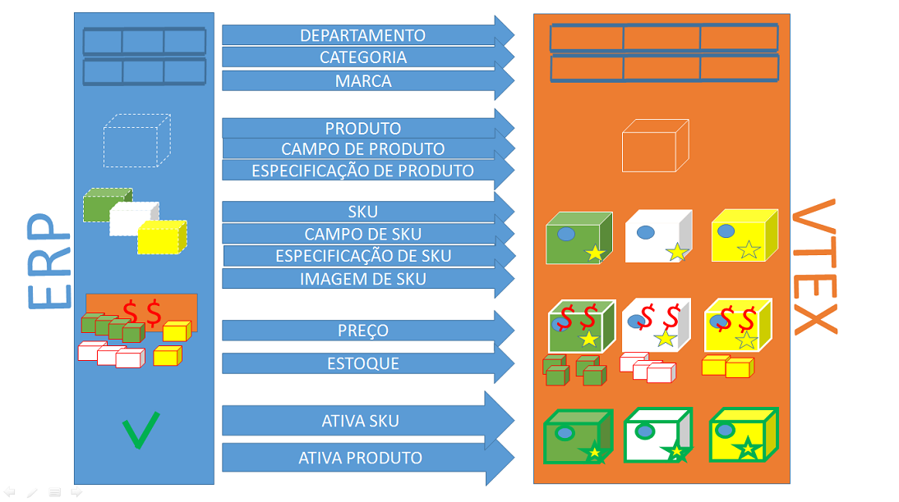

# ERP - Integração Completa de Catálogo e Condições Comerciais com a VTEX

Este documento tem por objetivo auxiliar o integrador na integração de catálogo, condição comercial(preço e estoque) do ERP para a uma loja hospedada na versão smartcheckout da VTEX. Nesse tipo de integração a mairia da adminstração da loja está ERP.

 

##1 - Catalogo Fluxo Completo##
Nesse cenário de fluxo completo, a maioria dos dados de produtos e SKUs são manipulados pelo ERP (marca, imagens, categoria, ativação, etc...). A manipulação de campos de especificação nesse modelo é possivel ser feita por API REST, mais a melhor prática seria pelo admin da VTEX

Para o ERP integrar o catálogo com um da loja na VTEX, deverá usar o webservice da própria loja, que por definição atenderá em [https:webservice-nomedaloja-vtexcommerce.com.br/service.svc?wsdl](https:webservice-nomedaloja-vtexcommerce.com.br/service.svc?wsdl "web service da loja"). As credenciais de acesso ao webservice deverão ser solicitadas junto ao administrador da loja.

Futuramente além do serviço SOAP (webservice) estaremos também oferecendo integração de catálogo por APIs REST (JSON) bem definidas e de alta performance.

###1.1 - Organização dos Produtos Dentro da Loja###

Geralmente, os produtos são organizados dentro da loja em estruturas mercadológicas formadas por:

1. **Departamento** - categoria cujo id de categoria pai é **nulo**, 
2. **Categoria** - categoria cujo id de categoria pai é um **departamento**,
3. **SubCategoria**. categoria cujo id de categoria pai é um **categoria**

*Exemplo:*  
*Departamento/Categoria/SubCategoria/Produto*  
*Ferramentas/Eletricas/Furradeiras/Super Drill*

###Departamento###
Segue abaixo exemplos de como inserir os Departamentos e as Categorias por webservice:

_request:_

	<soapenv:Envelope xmlns:soapenv="http://schemas.xmlsoap.org/soap/envelope/" xmlns:tem="http://tempuri.org/" xmlns:vtex="http://schemas.datacontract.org/2004/07/Vtex.Commerce.WebApps.AdminWcfService.Contracts">
	   <soapenv:Header/>
	   <soapenv:Body>
	      <tem:CategoryInsertUpdate>
	         <tem:category>
	            <vtex:Description>Departamento de Artesanato</vtex:Description>
	            <vtex:IsActive>true</vtex:IsActive>
	            <vtex:Keywords>Departamento Keywords</vtex:Keywords>
	            <vtex:Name>Departamento Artesanato</vtex:Name>
	            <vtex:Title>Departamento Artesanato</vtex:Title>
	         </tem:category>
	      </tem:CategoryInsertUpdate>
	   </soapenv:Body>
	</soapenv:Envelope>

_response:_
	
	<s:Envelope xmlns:s="http://schemas.xmlsoap.org/soap/envelope/">
	   <s:Body>
	      <CategoryInsertUpdateResponse xmlns="http://tempuri.org/">
	         <CategoryInsertUpdateResult xmlns:a="http://schemas.datacontract.org/2004/07/Vtex.Commerce.WebApps.AdminWcfService.Contracts" xmlns:i="http://www.w3.org/2001/XMLSchema-instance">
	            <a:AdWordsRemarketingCode i:nil="true"/>
	            <a:Description>Departamento de Artesanato</a:Description>
	            <a:FatherCategoryId i:nil="true"/>
	            <a:Id>1000018</a:Id>
	            <a:IsActive>true</a:IsActive>
	            <a:Keywords>Departamento Keywords</a:Keywords>
	            <a:LomadeeCampaignCode i:nil="true"/>
	            <a:Name>Departamento Artesanato</a:Name>
	            <a:Title>Departamento Artesanato</a:Title>
	         </CategoryInsertUpdateResult>
	      </CategoryInsertUpdateResponse>
	   </s:Body>
	</s:Envelope>

###Categoria###

_request:_

	<soapenv:Envelope xmlns:soapenv="http://schemas.xmlsoap.org/soap/envelope/" xmlns:tem="http://tempuri.org/" xmlns:vtex="http://schemas.datacontract.org/2004/07/Vtex.Commerce.WebApps.AdminWcfService.Contracts">
	   <soapenv:Header/>
	   <soapenv:Body>
	      <tem:CategoryInsertUpdate>
	         <tem:category>
	            <vtex:Description>Artesanato de Barro</vtex:Description>
	            <vtex:FatherCategoryId>1000018</vtex:FatherCategoryId>
	            <vtex:IsActive>true</vtex:IsActive>
	            <vtex:Keywords>Barro</vtex:Keywords>
	            <vtex:Name>Artesanato de Barro</vtex:Name>
	            <vtex:Title>Artesanato de Barro</vtex:Title>
	         </tem:category>
	      </tem:CategoryInsertUpdate>
	   </soapenv:Body>
	</soapenv:Envelope>

_response_:

	<s:Envelope xmlns:s="http://schemas.xmlsoap.org/soap/envelope/">
	   <s:Body>
	      <CategoryInsertUpdateResponse xmlns="http://tempuri.org/">
	         <CategoryInsertUpdateResult xmlns:a="http://schemas.datacontract.org/2004/07/Vtex.Commerce.WebApps.AdminWcfService.Contracts" xmlns:i="http://www.w3.org/2001/XMLSchema-instance">
	            <a:AdWordsRemarketingCode i:nil="true"/>
	            <a:Description>Artesanato de Barro</a:Description>
	            <a:FatherCategoryId>1000018</a:FatherCategoryId>
	            <a:Id>1000019</a:Id>
	            <a:IsActive>true</a:IsActive>
	            <a:Keywords>Barro</a:Keywords>
	            <a:LomadeeCampaignCode i:nil="true"/>
	            <a:Name>Artesanato de Barro</a:Name>
	            <a:Title>Artesanato de Barro</a:Title>
	         </CategoryInsertUpdateResult>
	      </CategoryInsertUpdateResponse>
	   </s:Body>
	</s:Envelope>

###Sub Categoria###

_request:_

	<soapenv:Envelope xmlns:soapenv="http://schemas.xmlsoap.org/soap/envelope/" xmlns:tem="http://tempuri.org/" xmlns:vtex="http://schemas.datacontract.org/2004/07/Vtex.Commerce.WebApps.AdminWcfService.Contracts">
	   <soapenv:Header/>
	   <soapenv:Body>
	      <tem:CategoryInsertUpdate>
	         <tem:category>
	            <vtex:Description>Barro Vermelho</vtex:Description>
	            <vtex:FatherCategoryId>1000019</vtex:FatherCategoryId>
	            <vtex:IsActive>true</vtex:IsActive>
	            <vtex:Keywords>Barro Vermelho</vtex:Keywords>
	            <vtex:Name>Artesanato de Barro Vermelho</vtex:Name>
	            <vtex:Title>Artesanato de Barro Vermelho</vtex:Title>
	         </tem:category>
	      </tem:CategoryInsertUpdate>
	   </soapenv:Body>
	</soapenv:Envelope>

_response:_

	<s:Envelope xmlns:s="http://schemas.xmlsoap.org/soap/envelope/">
	   <s:Body>
	      <CategoryInsertUpdateResponse xmlns="http://tempuri.org/">
	         <CategoryInsertUpdateResult xmlns:a="http://schemas.datacontract.org/2004/07/Vtex.Commerce.WebApps.AdminWcfService.Contracts" xmlns:i="http://www.w3.org/2001/XMLSchema-instance">
	            <a:AdWordsRemarketingCode i:nil="true"/>
	            <a:Description>Barro Vermelho</a:Description>
	            <a:FatherCategoryId>1000019</a:FatherCategoryId>
	            <a:Id>1000020</a:Id>
	            <a:IsActive>true</a:IsActive>
	            <a:Keywords>Barro Vermelho</a:Keywords>
	            <a:LomadeeCampaignCode i:nil="true"/>
	            <a:Name>Artesanato de Barro Vermelho</a:Name>
	            <a:Title>Artesanato de Barro Vermelho</a:Title>
	         </CategoryInsertUpdateResult>
	      </CategoryInsertUpdateResponse>
	   </s:Body>
	</s:Envelope>

###Marca###
Segue abaixo exemplo de como inserir uma Marca por webservice.  

_request:_

	<soapenv:Envelope xmlns:soapenv="http://schemas.xmlsoap.org/soap/envelope/" xmlns:tem="http://tempuri.org/" xmlns:vtex="http://schemas.datacontract.org/2004/07/Vtex.Commerce.WebApps.AdminWcfService.Contracts">
	   <soapenv:Header/>
	   <soapenv:Body>
	      <tem:BrandInsertUpdate>
	         <tem:brand>
	            <vtex:Description>Marca DuBom</vtex:Description>
	            <vtex:IsActive>true</vtex:IsActive>
	            <vtex:Keywords>DuBom Keywords</vtex:Keywords>
	            <vtex:Name>DuBom</vtex:Name>
	            <vtex:Title>DuBom</vtex:Title>
	         </tem:brand>
	      </tem:BrandInsertUpdate>
	   </soapenv:Body>
	</soapenv:Envelope>

_response:_

	<s:Envelope xmlns:s="http://schemas.xmlsoap.org/soap/envelope/">
	   <s:Body>
	      <BrandInsertUpdateResponse xmlns="http://tempuri.org/">
	         <BrandInsertUpdateResult xmlns:a="http://schemas.datacontract.org/2004/07/Vtex.Commerce.WebApps.AdminWcfService.Contracts" xmlns:i="http://www.w3.org/2001/XMLSchema-instance">
	            <a:AdWordsRemarketingCode i:nil="true"/>
	            <a:Description>Marca DuBom</a:Description>
	            <a:Id>2000011</a:Id>
	            <a:IsActive>true</a:IsActive>
	            <a:Keywords>DuBom Keywords</a:Keywords>
	            <a:LomadeeCampaignCode i:nil="true"/>
	            <a:Name>DuBom</a:Name>
	            <a:Title>DuBom</a:Title>
	         </BrandInsertUpdateResult>
	      </BrandInsertUpdateResponse>
	   </s:Body>
	</s:Envelope

###1.2 - Produtos e SKUs###

Qual é a diferença entre produto e SKU?

**Produto** é uma definição mais genérica de algo que é ofertado ao cliente. 

*Exemplo: Geladeria, Camiseta, Bola*
 
**SKU** é uma sigla em ingles de "Stock Keeping Unit", em português Unidade de Manutenção de Estoque,
ou seja, uma SKU define uma variação de um produto.

*Exemplo: Geladeira Branca 110V, Camiseta Amarela Grande*

No modelo de cadastro de Produtos e SKUs da VTEX, um SKU sempre será filha de um Produto (não existe SKU sem produto), mesmo que esse produto não tenha variçãoes, e nesse caso será 1 SKU para 1 produto.

*Exemplo: Produto Bola Jabulani com a SKU Bola Jabulani*

###Produto###

Exemplo de request para inserir Produto pelo webservice.

_request:_

	<soapenv:Envelope xmlns:soapenv="http://schemas.xmlsoap.org/soap/envelope/" xmlns:tem="http://tempuri.org/" xmlns:vtex="http://schemas.datacontract.org/2004/07/Vtex.Commerce.WebApps.AdminWcfService.Contracts" xmlns:arr="http://schemas.microsoft.com/2003/10/Serialization/Arrays">
	   <soapenv:Header/>
	   <soapenv:Body>
	      <tem:ProductInsertUpdate>
	         <tem:productVO>
	            <vtex:BrandId>2000011</vtex:BrandId> //id da marca
	            <vtex:CategoryId>1000020</vtex:CategoryId> //id da categoria
	            <vtex:DepartmentId>1000018</vtex:DepartmentId> //id do departamento
	            <vtex:Description>Vaso de barro vermelho, feito a mão com barro do mar vermelho</vtex:Description> //descrição
	            <vtex:DescriptionShort>Vaso de barro vermelho artesanal</vtex:DescriptionShort> descrição curta
	            <vtex:IsActive>true</vtex:IsActive> // true
	            <vtex:IsVisible>true</vtex:IsVisible> // vai ser visível no site
	            <vtex:KeyWords> Barro, vaso, vermelho</vtex:KeyWords> //palavras chaves
	            <vtex:LinkId>vaso_barro_vermelho</vtex:LinkId> //link do produto na loja
	            <vtex:ListStoreId> //pra qual canal de vendas = loja principal = 1
	               	<arr:int>1</arr:int> 
		       		<arr:int>2</arr:int>
	            </vtex:ListStoreId>
	            <vtex:MetaTagDescription>Vaso de barro vermelho, feito a mão com barro do mar vermelho</vtex:MetaTagDescription>
	            <vtex:Name>Vaso Artesanal de Barro Vermelho</vtex:Name> //nome
	             <vtex:RefId>1234567890</vtex:RefId> //id do produto no ERP
	            <vtex:Title>Vaso Artesanal de Barro Vermelho</vtex:Title>
	         </tem:productVO>
	      </tem:ProductInsertUpdate>
	   </soapenv:Body>
	</soapenv:Envelope>

_response:_

	<s:Envelope xmlns:s="http://schemas.xmlsoap.org/soap/envelope/">
	   <s:Body>
	      <ProductInsertUpdateResponse xmlns="http://tempuri.org/">
	         <ProductInsertUpdateResult xmlns:a="http://schemas.datacontract.org/2004/07/Vtex.Commerce.WebApps.AdminWcfService.Contracts" xmlns:i="http://www.w3.org/2001/XMLSchema-instance">
	            <a:AdWordsRemarketingCode i:nil="true"/>
	            <a:BrandId>2000011</a:BrandId>
	            <a:CategoryId>1000020</a:CategoryId>
	            <a:DepartmentId>1000018</a:DepartmentId>
	            <a:Description>Vaso de barro vermelho, feito a mão com barro do mar vermelho</a:Description>
	            <a:DescriptionShort>Vaso de barro vermelho artesanal</a:DescriptionShort>
	            <a:Id>31018369</a:Id>
	            <a:IsActive>false</a:IsActive>
	            <a:IsVisible>true</a:IsVisible>
	            <a:KeyWords>Barro, vaso, vermelho</a:KeyWords>
	            <a:LinkId>vaso_barro_vermelho</a:LinkId>
	            <a:ListStoreId xmlns:b="http://schemas.microsoft.com/2003/10/Serialization/Arrays">
	               <b:int>1</b:int>
	               <b:int>2</b:int>
	            </a:ListStoreId>
	            <a:LomadeeCampaignCode i:nil="true"/>
	            <a:MetaTagDescription>Vaso de barro vermelho, feito a mão com barro do mar vermelho</a:MetaTagDescription>
	            <a:Name>Vaso Artesanal de Barro Vermelho</a:Name>
	            <a:RefId>1234567890</a:RefId>
	            <a:ReleaseDate i:nil="true"/>
	            <a:ShowWithoutStock>true</a:ShowWithoutStock>
	            <a:SupplierId i:nil="true"/>
	            <a:TaxCode i:nil="true"/>
	            <a:Title>Vaso Artesanal de Barro Vermelho</a:Title>
	         </ProductInsertUpdateResult>
	      </ProductInsertUpdateResponse>
	   </s:Body>
	</s:Envelope>

###Fields###

Os fields genéricos dos produtos devem ser adicionado a categoria direta do produto e indicados com IsStockKeepingUnit = false, e os fileds específicos de SKU devem ser inseridos na Categoria direta da SKU e indicados com IsStockKeepingUnit = true. Não temos metodos no webservice para inserir Fields (campos), uma API REST deve ser usada para isso. Exemplo de chamda a PI REST para adiconar campos:  

endpoint: **http://sandboxintegracao.vtexcommercebeta.com.br/api/catalog_system/pvt/specification/fieldInsertUpdate**  
verb: **POST**  
Content-Type: **application/json**  
Accept: **application/json**

_Exemplo do POST:_ 

	{
	  "Name": "Material",
	  "CategoryId": 1000018, //se nulo vale pra todas as categorias e departamento
	  "FieldId": null,
	  "IsActive": true,
	  "IsRequired": false,
	  "FieldTypeId": 7, // 1|2|4|5|6|7|8|9
	  "FieldTypeName": "CheckBox", // Texto|Texto Grande|Número|Combo|Radio|CheckBox|Texto Indexado|Texto Grande Indexado
	  "FieldValueId": null,
	  "Description": null,
	  "IsStockKeepingUnit": false, //
	  "IsFilter": true,
	  "IsOnProductDetails": true,
	  "Position": 3,
	  "IsWizard": false,
	  "IsTopMenuLinkActive": true,
	  "IsSideMenuLinkActive": true,
	  "DefaultValue": null,
	  "FieldGroupId": 3
	}

###SKUs###

Uma vez inseridos todos os produtos, que teoricamente são os pais das SKUs, chegou o momento de enviar as SKUs. Exemplo dos request para inserir uma SKU na VTEX no webservice.

_request:_  

	<soapenv:Envelope xmlns:soapenv="http://schemas.xmlsoap.org/soap/envelope/" xmlns:tem="http://tempuri.org/" xmlns:vtex="http://schemas.datacontract.org/2004/07/Vtex.Commerce.WebApps.AdminWcfService.Contracts">
	   <soapenv:Header/>
	   <soapenv:Body>
	      <tem:StockKeepingUnitInsertUpdate>
	         <tem:stockKeepingUnitVO>
	            <vtex:CubicWeight>100</vtex:CubicWeight>
	            <vtex:Height>15</vtex:Height>
	            <vtex:IsActive>true</vtex:IsActive>
	            <vtex:IsAvaiable>true</vtex:IsAvaiable>
	            <vtex:IsKit>false</vtex:IsKit>
	            <vtex:Length>15</vtex:Length>
				<vtex:ListPrice>150.0</vtex:ListPrice>
	            <vtex:ModalId>1</vtex:ModalId>
	            <vtex:ModalType>Vidro</vtex:ModalType>
	            <vtex:Name>Vaso Artesanal de Barro Vermelho Escuro </vtex:Name>
   				<vtex:Price>110.0</vtex:Price>
	            <vtex:ProductId>31018369</vtex:ProductId>
	            <vtex:RealHeight>17</vtex:RealHeight>
	            <vtex:RealLength>17</vtex:RealLength>
	            <vtex:RealWeightKg>10</vtex:RealWeightKg>
	            <vtex:RealWidth>17</vtex:RealWidth>
	            <vtex:RefId>00123456</vtex:RefId>
	            <vtex:RewardValue>0</vtex:RewardValue>
	            <vtex:StockKeepingUnitEans>
	               <vtex:StockKeepingUnitEanDTO>
	                  <vtex:Ean>0123456789123</vtex:Ean>
	               </vtex:StockKeepingUnitEanDTO>
	            </vtex:StockKeepingUnitEans>
	            <vtex:UnitMultiplier>1</vtex:UnitMultiplier>
	            <vtex:WeightKg>9</vtex:WeightKg>
	            <vtex:Width>15</vtex:Width>
	         </tem:stockKeepingUnitVO>
	      </tem:StockKeepingUnitInsertUpdate>
	   </soapenv:Body>
	</soapenv:Envelope>

_response:_
	
	<s:Envelope xmlns:s="http://schemas.xmlsoap.org/soap/envelope/">
	   <s:Body>
	      <StockKeepingUnitInsertUpdateResponse xmlns="http://tempuri.org/">
	         <StockKeepingUnitInsertUpdateResult xmlns:a="http://schemas.datacontract.org/2004/07/Vtex.Commerce.WebApps.AdminWcfService.Contracts" xmlns:i="http://www.w3.org/2001/XMLSchema-instance">
	            <a:CommercialConditionId i:nil="true"/>
	            <a:CostPrice>1</a:CostPrice>
	            <a:CubicWeight>100</a:CubicWeight>
	            <a:DateUpdated>2014-10-29T19:03:17.718427</a:DateUpdated>
	            <a:EstimatedDateArrival i:nil="true"/>
	            <a:Height>15</a:Height>
	            <a:Id>31018371</a:Id>
	            <a:InternalNote i:nil="true"/>
	            <a:IsActive>false</a:IsActive>
	            <a:IsAvaiable>false</a:IsAvaiable>
	            <a:IsKit>false</a:IsKit>
	            <a:Length>15</a:Length>
	            <a:ListPrice>150.0</a:ListPrice>
	            <a:ManufacturerCode i:nil="true"/>
	            <a:MeasurementUnit>un</a:MeasurementUnit>
	            <a:ModalId>1</a:ModalId>
	            <a:ModalType>Vidro</a:ModalType>
	            <a:Name>Vaso Artesanal de Barro Vermelho Escuro</a:Name>
	            <a:Price>110.0</a:Price>
	            <a:ProductId>31018369</a:ProductId>
	            <a:ProductName>Vaso Artesanal de Barro Vermelho</a:ProductName>
	            <a:RealHeight>17</a:RealHeight>
	            <a:RealLength>17</a:RealLength>
	            <a:RealWeightKg>10</a:RealWeightKg>
	            <a:RealWidth>17</a:RealWidth>
	            <a:RefId>00123456</a:RefId>
	            <a:RewardValue>0</a:RewardValue>
	            <a:StockKeepingUnitEans>
	               <a:StockKeepingUnitEanDTO>
	                  <a:Ean>0123456789123</a:Ean>
	               </a:StockKeepingUnitEanDTO>
	            </a:StockKeepingUnitEans>
	            <a:UnitMultiplier>1</a:UnitMultiplier>
	            <a:WeightKg>9</a:WeightKg>
	            <a:Width>15</a:Width>
	         </StockKeepingUnitInsertUpdateResult>
	      </StockKeepingUnitInsertUpdateResponse>
	   </s:Body>
	</s:Envelope>

###Imagens###
Exemplo de request para inserir Imagens para uma SKU no webservice.

_request:_  

	<soapenv:Envelope xmlns:soapenv="http://schemas.xmlsoap.org/soap/envelope/" xmlns:tem="http://tempuri.org/">
	   <soapenv:Header/>
	   <soapenv:Body>
	      <tem:ImageServiceInsertUpdate>
	         <tem:urlImage>https://encrypted-tbn3.gstatic.com/images?q=tbn:ANd9GcQ6Lu0obmddsQX3JELe04hUs_hSelsmU8_W1yn5ztgdAk5SJC7D</tem:urlImage>
	         <tem:imageName>Barro Vermelho Escuro</tem:imageName>
	         <tem:stockKeepingUnitId>31018371</tem:stockKeepingUnitId>
	      </tem:ImageServiceInsertUpdate>
	   </soapenv:Body>
	</soapenv:Envelope>

_response:_

	<s:Envelope xmlns:s="http://schemas.xmlsoap.org/soap/envelope/">
	   <s:Body>
	      <ImageServiceInsertUpdateResponse xmlns="http://tempuri.org/"/>
	   </s:Body>
	</s:Envelope>

_request 2:_  

	<soapenv:Envelope xmlns:soapenv="http://schemas.xmlsoap.org/soap/envelope/" xmlns:tem="http://tempuri.org/">
	   <soapenv:Header/>
	   <soapenv:Body>
	      <tem:ImageServiceInsertUpdate>
	         <tem:urlImage>http://1.bp.blogspot.com/_ZANjG3oA2BI/TCJfvX-7daI/AAAAAAAADZ0/yO5MwjMtjdI/s400/vaso_5cm.jpg</tem:urlImage>
	         <tem:imageName>Barro Vermelho Claro</tem:imageName>
	         <tem:stockKeepingUnitId>31018372</tem:stockKeepingUnitId>
	          <tem:fileId>31018372</tem:fileId>
	      </tem:ImageServiceInsertUpdate>
	   </soapenv:Body>
	</soapenv:Envelope>

_response 2:_  

	<s:Envelope xmlns:s="http://schemas.xmlsoap.org/soap/envelope/">
	   <s:Body>
	      <ImageServiceInsertUpdateResponse xmlns="http://tempuri.org/"/>
	   </s:Body>
	</s:Envelope>

##2 - Preço e Estoque##
Uma vez cadastradas os produtos e as SKUs na loja da VTEX, é necessário alimentar o estoque e acertar o preço na tabela de preço (se no momento de inserir a SKU não enviou o preço).

####2.1 - Preço ####
Se no momento sa inserção da SKU não foi enviado um preço válido, o sistem colocou um preço de segurança, e neste cenário é necessário corrigir o preço da mesma. Isso pode ser feito direto no admin da loja na VTEX (_urldaloja/admin/Site/SkuTabelaValor.aspx_), ou usando a API REST do sistema de **Pricing**.

endpoint: **http://sandboxintegracao.vtexcommercebeta.com.br/api/pricing/pvt/price-sheet**  
verb: **POST**  
Content-Type: **application/json**  
Accept: **application/json**

_Exemplo do POST:_

	[
	  {
	    "Id": null,
	    "itemId": 31018371, 
	    "salesChannel": 1, 
	    "price": 110.0, 
	    "listPrice": 150.0, 
	    "validFrom": "2012-12-05T17:00:03.103", 
	    "validTo": "2016-12-05T17:00:03.103"
	  },
	  {
	    "Id": null,
	    "itemId": 31018372,
	    "salesChannel": 1,
	    "price": 125.5,
	    "listPrice": 160.0,
	    "validFrom": "2011-03-04T00:00:00",
	    "validTo": "2015-03-28T00:00:00"
	  }
	]

_response:_ 204

A documentação completa sobre a API de **Pricing** se encontra em:
http://lab.vtex.com/docs/logistics/api/latest/carrier/index.html

####2.2 - Estoque ####
Isso pode ser feito direto no admin da loja na VTEX (_urldaloja/admin/logistics/#/dashboard_), maneira rápida:

1. Criar o estoque,  
2. Criar a transpotadora,  
3. Criar a doca,
4. Colocar estoque nos itens  

Manipulando estoque através da API REST do sistema de **Logistics**:

Criar o estoque, criar a transpotadora e criar a doca no admin da VTEX, e depois usar a API REST do **Logistics** para manipular o estoque, como segue exemplo:

endpoint: **nomedaloja/api/logistics/pvt/inventory/warehouseitems/setbalance**    
verb: **POST**    
Content-Type: **application/json**    
Accept: **application/json**    

*Exemplo do POST:* 

	[
	  {
	    "wareHouseId": "1_1",
	    "itemId": "31018371",
	    "quantity": 50
	  },
	  {
	    "wareHouseId": "1_1",
	    "itemId": "31018372",
	    "quantity": 80
	  }
	]

_response:_ 200
true

A documentação completa sobre a API de **Logistics** se encontra em:
_http://lab.vtex.com/docs/logistics/api/latest/carrier/index.html_

###Ativa SKUs###
Após as SKUs estarem ordem, basta ativá-las. Exempos de chds d atiação de SKU

_request:_  

	<soapenv:Envelope xmlns:soapenv="http://schemas.xmlsoap.org/soap/envelope/" xmlns:tem="http://tempuri.org/">
	   <soapenv:Header/>
	   <soapenv:Body>
	      <tem:StockKeepingUnitActive>
	         <tem:idStockKeepingUnit>31018371</tem:idStockKeepingUnit>
	      </tem:StockKeepingUnitActive>
	   </soapenv:Body>
	</soapenv:Envelope>

_response:_  

	<s:Envelope xmlns:s="http://schemas.xmlsoap.org/soap/envelope/">
	   <s:Body>
	      <StockKeepingUnitActiveResponse xmlns="http://tempuri.org/"/>
	   </s:Body>
	</s:Envelope>

_request 2:_  

	<soapenv:Envelope xmlns:soapenv="http://schemas.xmlsoap.org/soap/envelope/" xmlns:tem="http://tempuri.org/">
	   <soapenv:Header/>
	   <soapenv:Body>
	      <tem:StockKeepingUnitActive>
	         <tem:idStockKeepingUnit>31018372</tem:idStockKeepingUnit>
	      </tem:StockKeepingUnitActive>
	   </soapenv:Body>
	</soapenv:Envelope>

_response 2:_  

	<s:Envelope xmlns:s="http://schemas.xmlsoap.org/soap/envelope/">
	   <s:Body>
	      <StockKeepingUnitActiveResponse xmlns="http://tempuri.org/"/>
	   </s:Body>
	</s:Envelope>

##Alterações de SKUs##
Após uma SKU ser inserida com sucesso, caso haja alguma necessidade de alguma alteração, deve se invocar o mesmo método de inserçao
passando o id de SKU que se deseja alterar. Alterações de preço não devem ser feitas pelo meto de insert/update de SKU. 
As alterações de preço devem ser feitas diretamente na API REST de **Pricing**

_request:_

	<soapenv:Envelope xmlns:soapenv="http://schemas.xmlsoap.org/soap/envelope/" xmlns:tem="http://tempuri.org/" xmlns:vtex="http://schemas.datacontract.org/2004/07/Vtex.Commerce.WebApps.AdminWcfService.Contracts">
	   <soapenv:Header/>
	   <soapenv:Body>
	      <tem:StockKeepingUnitInsertUpdate>
	         <tem:stockKeepingUnitVO>
	            <vtex:CubicWeight>100</vtex:CubicWeight>
	            <vtex:Height>15</vtex:Height>
	            <vtex:IsActive>true</vtex:IsActive>
	            <vtex:IsAvaiable>true</vtex:IsAvaiable>
	            <vtex:IsKit>false</vtex:IsKit>
	            <vtex:Length>15</vtex:Length>
		        <vtex:ListPrice>150.0</vtex:ListPrice>
	            <vtex:ModalId>1</vtex:ModalId>
	            <vtex:ModalType>Vidro</vtex:ModalType>
	            <vtex:Name>Vaso Artesanal de Barro Vermelho Escuro </vtex:Name>
		        <vtex:Price>110.0</vtex:Price>
	            <vtex:ProductId>31018369</vtex:ProductId>
	            <vtex:RealHeight>17</vtex:RealHeight>
	            <vtex:RealLength>17</vtex:RealLength>
	            <vtex:RealWeightKg>10</vtex:RealWeightKg>
	            <vtex:RealWidth>17</vtex:RealWidth>
	            <vtex:RefId>00123456</vtex:RefId>
	            <vtex:RewardValue>0</vtex:RewardValue>
	            <vtex:StockKeepingUnitEans>
	               <vtex:StockKeepingUnitEanDTO>
	                  <vtex:Ean>0123456789123</vtex:Ean>
	               </vtex:StockKeepingUnitEanDTO>
	            </vtex:StockKeepingUnitEans>
	            <vtex:UnitMultiplier>1</vtex:UnitMultiplier>
	            <vtex:WeightKg>9</vtex:WeightKg>
	            <vtex:Width>15</vtex:Width>
	         </tem:stockKeepingUnitVO>
	      </tem:StockKeepingUnitInsertUpdate>
	   </soapenv:Body>
	</soapenv:Envelope>

*Os campos Id ou RefId definem se será um insert ou um update, caso o id de SKU enviado ou o RefId enviado já existirem, será um update.

_response:_

	<s:Envelope xmlns:s="http://schemas.xmlsoap.org/soap/envelope/">
	   <s:Body>
	      <StockKeepingUnitInsertUpdateResponse xmlns="http://tempuri.org/">
	         <StockKeepingUnitInsertUpdateResult xmlns:a="http://schemas.datacontract.org/2004/07/Vtex.Commerce.WebApps.AdminWcfService.Contracts" xmlns:i="http://www.w3.org/2001/XMLSchema-instance">
	            <a:CommercialConditionId>1</a:CommercialConditionId>
	            <a:CostPrice>1.0000</a:CostPrice>
	            <a:CubicWeight>100</a:CubicWeight>
	            <a:DateUpdated>2014-10-31T19:23:48.6456023</a:DateUpdated>
	            <a:EstimatedDateArrival i:nil="true"/>
	            <a:Height>15</a:Height>
	            <a:Id>31018371</a:Id>
	            <a:InternalNote i:nil="true"/>
	            <a:IsActive>true</a:IsActive>
	            <a:IsAvaiable>false</a:IsAvaiable>
	            <a:IsKit>false</a:IsKit>
	            <a:Length>15</a:Length>
	            <a:ListPrice>150.0</a:ListPrice>
	            <a:ManufacturerCode i:nil="true"/>
	            <a:MeasurementUnit>un</a:MeasurementUnit>
	            <a:ModalId>1</a:ModalId>
	            <a:ModalType>Vidro</a:ModalType>
	            <a:Name>Vaso Artesanal de Barro Vermelho Escuro</a:Name>
	            <a:Price>110.0</a:Price>
	            <a:ProductId>31018369</a:ProductId>
	            <a:ProductName>Vaso Artesanal de Barro Vermelho</a:ProductName>
	            <a:RealHeight>17</a:RealHeight>
	            <a:RealLength>17</a:RealLength>
	            <a:RealWeightKg>10</a:RealWeightKg>
	            <a:RealWidth>17</a:RealWidth>
	            <a:RefId>00123456</a:RefId>
	            <a:RewardValue>0</a:RewardValue>
	            <a:StockKeepingUnitEans>
	               <a:StockKeepingUnitEanDTO>
	                  <a:Ean>0123456789123</a:Ean>
	               </a:StockKeepingUnitEanDTO>
	            </a:StockKeepingUnitEans>
	            <a:UnitMultiplier>1</a:UnitMultiplier>
	            <a:WeightKg>9</a:WeightKg>
	            <a:Width>15</a:Width>
	         </StockKeepingUnitInsertUpdateResult>
	      </StockKeepingUnitInsertUpdateResponse>
	   </s:Body>
	</s:Envelope>

###KIT###

 

Produto KIT:

_request:_

	<soapenv:Envelope xmlns:soapenv="http://schemas.xmlsoap.org/soap/envelope/" xmlns:tem="http://tempuri.org/" xmlns:vtex="http://schemas.datacontract.org/2004/07/Vtex.Commerce.WebApps.AdminWcfService.Contracts" xmlns:arr="http://schemas.microsoft.com/2003/10/Serialization/Arrays">
	   <soapenv:Header/>
	   <soapenv:Body>
	      <tem:ProductInsertUpdate>
	         <tem:productVO>
	            <vtex:BrandId>2000011</vtex:BrandId>
	            <vtex:CategoryId>1000020</vtex:CategoryId>
	            <vtex:DepartmentId>1000018</vtex:DepartmentId>
	            <vtex:Description>Pa e rastelo para jardinagem</vtex:Description>
	            <vtex:DescriptionShort>Pa e rastelo para jardinagem</vtex:DescriptionShort>
	            <vtex:IsActive>true</vtex:IsActive>
	            <vtex:IsVisible>true</vtex:IsVisible>
	            <vtex:KeyWords>pa rastelo</vtex:KeyWords>
	            <vtex:ListStoreId>
	               <arr:int>1</arr:int>
	            </vtex:ListStoreId>
	            <vtex:MetaTagDescription>Pa e rastelo para jardinagem</vtex:MetaTagDescription>
	            <vtex:Name>Kit pa e rastelo</vtex:Name>
	             <vtex:RefId>2234567890</vtex:RefId>
	            <vtex:Title>Kit pa e rastelo</vtex:Title>
	         </tem:productVO>
	      </tem:ProductInsertUpdate>
	   </soapenv:Body>
	</soapenv:Envelope>

_response:_

	<s:Envelope xmlns:s="http://schemas.xmlsoap.org/soap/envelope/">
	   <s:Body>
	      <ProductInsertUpdateResponse xmlns="http://tempuri.org/">
	         <ProductInsertUpdateResult xmlns:a="http://schemas.datacontract.org/2004/07/Vtex.Commerce.WebApps.AdminWcfService.Contracts" xmlns:i="http://www.w3.org/2001/XMLSchema-instance">
	            <a:AdWordsRemarketingCode i:nil="true"/>
	            <a:BrandId>2000011</a:BrandId>
	            <a:CategoryId>1000020</a:CategoryId>
	            <a:DepartmentId>1000018</a:DepartmentId>
	            <a:Description>Pa e rastelo para jardinagem</a:Description>
	            <a:DescriptionShort>Pa e rastelo para jardinagem</a:DescriptionShort>
	            <a:Id>31018370</a:Id>
	            <a:IsActive>false</a:IsActive>
	            <a:IsVisible>true</a:IsVisible>
	            <a:KeyWords>pa rastelo</a:KeyWords>
	            <a:LinkId>Kit-pa-e-rastelo</a:LinkId>
	            <a:ListStoreId xmlns:b="http://schemas.microsoft.com/2003/10/Serialization/Arrays">
	               <b:int>1</b:int>
	            </a:ListStoreId>
	            <a:LomadeeCampaignCode i:nil="true"/>
	            <a:MetaTagDescription>Pa e rastelo para jardinagem</a:MetaTagDescription>
	            <a:Name>Kit pa e rastelo</a:Name>
	            <a:RefId>2234567890</a:RefId>
	            <a:ReleaseDate i:nil="true"/>
	            <a:ShowWithoutStock>true</a:ShowWithoutStock>
	            <a:SupplierId i:nil="true"/>
	            <a:TaxCode i:nil="true"/>
	            <a:Title>Kit pa e rastelo</a:Title>
	         </ProductInsertUpdateResult>
	      </ProductInsertUpdateResponse>
	   </s:Body>
	</s:Envelope>

SKU KIT

	_request:_  
	
		<soapenv:Envelope xmlns:soapenv="http://schemas.xmlsoap.org/soap/envelope/" xmlns:tem="http://tempuri.org/" xmlns:vtex="http://schemas.datacontract.org/2004/07/Vtex.Commerce.WebApps.AdminWcfService.Contracts">
	   <soapenv:Header/>
	   <soapenv:Body>
	      <tem:StockKeepingUnitInsertUpdate>
	         <tem:stockKeepingUnitVO>
	            <vtex:CubicWeight>100</vtex:CubicWeight>
	            <vtex:Height>15</vtex:Height>
	            <vtex:IsActive>true</vtex:IsActive>
	            <vtex:IsAvaiable>true</vtex:IsAvaiable>
	            <vtex:IsKit>true</vtex:IsKit> //define que essa SKU, será um KIT - irreversível
	            <vtex:Length>15</vtex:Length>
		        <vtex:ListPrice>50.0</vtex:ListPrice> //define o preço DE do KIT
	            <vtex:ModalId>1</vtex:ModalId>
	            <vtex:Name>SKU do KIT</vtex:Name>
		        <vtex:Price>40.0</vtex:Price> //define o preço POR do KIT
	            <vtex:ProductId>31018370</vtex:ProductId>
	            <vtex:RealHeight>17</vtex:RealHeight>
	            <vtex:RealLength>17</vtex:RealLength>
	            <vtex:RealWeightKg>10</vtex:RealWeightKg>
	            <vtex:RealWidth>17</vtex:RealWidth>
	            <vtex:RefId>30123456</vtex:RefId>
	            <vtex:RewardValue>0</vtex:RewardValue>
	            <vtex:StockKeepingUnitEans>
	               <vtex:StockKeepingUnitEanDTO>
	                  <vtex:Ean>3123456789123</vtex:Ean>
	               </vtex:StockKeepingUnitEanDTO>
	            </vtex:StockKeepingUnitEans>
	            <vtex:UnitMultiplier>1</vtex:UnitMultiplier>
	            <vtex:WeightKg>9</vtex:WeightKg>
	            <vtex:Width>15</vtex:Width>
	         </tem:stockKeepingUnitVO>
	      </tem:StockKeepingUnitInsertUpdate>
	   </soapenv:Body>
	</soapenv:Envelope>

_response:_

	<s:Envelope xmlns:s="http://schemas.xmlsoap.org/soap/envelope/">
	   <s:Body>
	      <StockKeepingUnitInsertUpdateResponse xmlns="http://tempuri.org/">
	         <StockKeepingUnitInsertUpdateResult xmlns:a="http://schemas.datacontract.org/2004/07/Vtex.Commerce.WebApps.AdminWcfService.Contracts" xmlns:i="http://www.w3.org/2001/XMLSchema-instance">
	            <a:CommercialConditionId>1</a:CommercialConditionId>
	            <a:CostPrice>1.0000</a:CostPrice>
	            <a:CubicWeight>100</a:CubicWeight>
	            <a:DateUpdated>2014-11-03T13:58:10.3061928</a:DateUpdated>
	            <a:EstimatedDateArrival i:nil="true"/>
	            <a:Height>15</a:Height>
	            <a:Id>31018373</a:Id>
	            <a:InternalNote i:nil="true"/>
	            <a:IsActive>false</a:IsActive>
	            <a:IsAvaiable>false</a:IsAvaiable>
	            <a:IsKit>true</a:IsKit>
	            <a:Length>15</a:Length>
	            <a:ListPrice>50.0</a:ListPrice>
	            <a:ManufacturerCode i:nil="true"/>
	            <a:MeasurementUnit>un</a:MeasurementUnit>
	            <a:ModalId>1</a:ModalId>
	            <a:ModalType i:nil="true"/>
	            <a:Name>SKU do KIT</a:Name>
	            <a:Price>40.0</a:Price>
	            <a:ProductId>31018370</a:ProductId>
	            <a:ProductName>Kit pa e rastelo</a:ProductName>
	            <a:RealHeight>17</a:RealHeight>
	            <a:RealLength>17</a:RealLength>
	            <a:RealWeightKg>10</a:RealWeightKg>
	            <a:RealWidth>17</a:RealWidth>
	            <a:RefId>30123456</a:RefId>
	            <a:RewardValue>0</a:RewardValue>
	            <a:StockKeepingUnitEans>
	               <a:StockKeepingUnitEanDTO>
	                  <a:Ean>3123456789123</a:Ean>
	               </a:StockKeepingUnitEanDTO>
	            </a:StockKeepingUnitEans>
	            <a:UnitMultiplier>1</a:UnitMultiplier>
	            <a:WeightKg>9</a:WeightKg>
	            <a:Width>15</a:Width>
	         </StockKeepingUnitInsertUpdateResult>
	      </StockKeepingUnitInsertUpdateResponse>
	   </s:Body>
	</s:Envelope>

Imagem do SKU KIT

_request:_

	<soapenv:Envelope xmlns:soapenv="http://schemas.xmlsoap.org/soap/envelope/" xmlns:tem="http://tempuri.org/">
	   <soapenv:Header/>
	   <soapenv:Body>
	      <tem:ImageServiceInsertUpdate>
	         <tem:urlImage>http://img.ph2-jpg.posthaus.com.br/Web/posthaus/foto/brinquedos/jogos-e-outros-brinquedos/brinquedo-pa-e-rastelo_56855_600_1.jpg</tem:urlImage>
	         <tem:imageName>Pa_Rastelo</tem:imageName>
	         <tem:stockKeepingUnitId>31018373</tem:stockKeepingUnitId>
	          <tem:fileId>31018373</tem:fileId>
	      </tem:ImageServiceInsertUpdate>
	   </soapenv:Body>
	</soapenv:Envelope>

_response:_

	<s:Envelope xmlns:s="http://schemas.xmlsoap.org/soap/envelope/">
	   <s:Body>
	      <ImageServiceInsertUpdateResponse xmlns="http://tempuri.org/"/>
	   </s:Body>
	</s:Envelope>

PRODUTOS do KIT

_request:_

	<soapenv:Envelope xmlns:soapenv="http://schemas.xmlsoap.org/soap/envelope/" xmlns:tem="http://tempuri.org/" xmlns:vtex="http://schemas.datacontract.org/2004/07/Vtex.Commerce.WebApps.AdminWcfService.Contracts" xmlns:arr="http://schemas.microsoft.com/2003/10/Serialization/Arrays">
	   <soapenv:Header/>
	   <soapenv:Body>
	      <tem:ProductInsertUpdate>
	         <tem:productVO>
	            <vtex:BrandId>2000011</vtex:BrandId>
	            <vtex:CategoryId>1000020</vtex:CategoryId>
	            <vtex:DepartmentId>1000018</vtex:DepartmentId>
	            <vtex:Description>Pa</vtex:Description>
	            <vtex:DescriptionShort>Pa de jardim</vtex:DescriptionShort>
	            <vtex:IsActive>true</vtex:IsActive>
	            <vtex:IsVisible>false</vtex:IsVisible>
	            <vtex:KeyWords>Pa de jardim</vtex:KeyWords>
	            <vtex:LinkId>pa_jardim</vtex:LinkId>
	            <vtex:ListStoreId>
	               <arr:int>1</arr:int>
	            </vtex:ListStoreId>
	            <vtex:MetaTagDescription>Pa de jardim</vtex:MetaTagDescription>
	            <vtex:Name>Pa de jardim</vtex:Name>
	             <vtex:RefId>5234567891</vtex:RefId>
	            <vtex:Title>Pa de jardim</vtex:Title>
	         </tem:productVO>
	      </tem:ProductInsertUpdate>
	   </soapenv:Body>
	</soapenv:Envelope>

_response:_

	<s:Envelope xmlns:s="http://schemas.xmlsoap.org/soap/envelope/">
	   <s:Body>
	      <ProductInsertUpdateResponse xmlns="http://tempuri.org/">
	         <ProductInsertUpdateResult xmlns:a="http://schemas.datacontract.org/2004/07/Vtex.Commerce.WebApps.AdminWcfService.Contracts" xmlns:i="http://www.w3.org/2001/XMLSchema-instance">
	            <a:AdWordsRemarketingCode i:nil="true"/>
	            <a:BrandId>2000011</a:BrandId>
	            <a:CategoryId>1000020</a:CategoryId>
	            <a:DepartmentId>1000018</a:DepartmentId>
	            <a:Description>Pa</a:Description>
	            <a:DescriptionShort>Pa de jardim</a:DescriptionShort>
	            <a:Id>31018371</a:Id>
	            <a:IsActive>false</a:IsActive>
	            <a:IsVisible>false</a:IsVisible>
	            <a:KeyWords>Pa de jardim</a:KeyWords>
	            <a:LinkId>pa_jardim</a:LinkId>
	            <a:ListStoreId xmlns:b="http://schemas.microsoft.com/2003/10/Serialization/Arrays">
	               <b:int>1</b:int>
	            </a:ListStoreId>
	            <a:LomadeeCampaignCode i:nil="true"/>
	            <a:MetaTagDescription>Pa de jardim</a:MetaTagDescription>
	            <a:Name>Pa de jardim</a:Name>
	            <a:RefId>5234567891</a:RefId>
	            <a:ReleaseDate i:nil="true"/>
	            <a:ShowWithoutStock>true</a:ShowWithoutStock>
	            <a:SupplierId i:nil="true"/>
	            <a:TaxCode i:nil="true"/>
	            <a:Title>Pa de jardim</a:Title>
	         </ProductInsertUpdateResult>
	      </ProductInsertUpdateResponse>
	   </s:Body>
	</s:Envelope>

_request 2:_

	<soapenv:Envelope xmlns:soapenv="http://schemas.xmlsoap.org/soap/envelope/" xmlns:tem="http://tempuri.org/" xmlns:vtex="http://schemas.datacontract.org/2004/07/Vtex.Commerce.WebApps.AdminWcfService.Contracts" xmlns:arr="http://schemas.microsoft.com/2003/10/Serialization/Arrays">
	   <soapenv:Header/>
	   <soapenv:Body>
	      <tem:ProductInsertUpdate>
	         <tem:productVO>
	            <vtex:BrandId>2000011</vtex:BrandId>
	            <vtex:CategoryId>1000020</vtex:CategoryId>
	            <vtex:DepartmentId>1000018</vtex:DepartmentId>
	            <vtex:Description>Rastelo</vtex:Description>
	            <vtex:DescriptionShort>Rastelo de jardim</vtex:DescriptionShort>
	            <vtex:IsActive>true</vtex:IsActive>
	            <vtex:IsVisible>false</vtex:IsVisible>
	            <vtex:KeyWords>Rastelo de jardim</vtex:KeyWords>
	            <vtex:ListStoreId>
	               <arr:int>1</arr:int>
	            </vtex:ListStoreId>
	            <vtex:MetaTagDescription>Rastelo de jardim</vtex:MetaTagDescription>
	            <vtex:Name>Rastelo de jardim</vtex:Name>
	             <vtex:RefId>6234567892</vtex:RefId>
	            <vtex:Title>Rastelo de jardim</vtex:Title>
	         </tem:productVO>
	      </tem:ProductInsertUpdate>
	   </soapenv:Body>
	</soapenv:Envelope>

_response 2:_

	<s:Envelope xmlns:s="http://schemas.xmlsoap.org/soap/envelope/">
	   <s:Body>
	      <ProductInsertUpdateResponse xmlns="http://tempuri.org/">
	         <ProductInsertUpdateResult xmlns:a="http://schemas.datacontract.org/2004/07/Vtex.Commerce.WebApps.AdminWcfService.Contracts" xmlns:i="http://www.w3.org/2001/XMLSchema-instance">
	            <a:AdWordsRemarketingCode i:nil="true"/>
	            <a:BrandId>2000011</a:BrandId>
	            <a:CategoryId>1000020</a:CategoryId>
	            <a:DepartmentId>1000018</a:DepartmentId>
	            <a:Description>Rastelo</a:Description>
	            <a:DescriptionShort>Rastelo de jardim</a:DescriptionShort>
	            <a:Id>31018372</a:Id>
	            <a:IsActive>false</a:IsActive>
	            <a:IsVisible>false</a:IsVisible>
	            <a:KeyWords>Rastelo de jardim</a:KeyWords>
	            <a:LinkId>Rastelo-de-jardim</a:LinkId>
	            <a:ListStoreId xmlns:b="http://schemas.microsoft.com/2003/10/Serialization/Arrays">
	               <b:int>1</b:int>
	            </a:ListStoreId>
	            <a:LomadeeCampaignCode i:nil="true"/>
	            <a:MetaTagDescription>Rastelo de jardim</a:MetaTagDescription>
	            <a:Name>Rastelo de jardim</a:Name>
	            <a:RefId>6234567892</a:RefId>
	            <a:ReleaseDate i:nil="true"/>
	            <a:ShowWithoutStock>true</a:ShowWithoutStock>
	            <a:SupplierId i:nil="true"/>
	            <a:TaxCode i:nil="true"/>
	            <a:Title>Rastelo de jardim</a:Title>
	         </ProductInsertUpdateResult>
	      </ProductInsertUpdateResponse>
	   </s:Body>
	</s:Envelope>

SKUs do KIT

_request:_

	<soapenv:Envelope xmlns:soapenv="http://schemas.xmlsoap.org/soap/envelope/" xmlns:tem="http://tempuri.org/" xmlns:vtex="http://schemas.datacontract.org/2004/07/Vtex.Commerce.WebApps.AdminWcfService.Contracts">
	   <soapenv:Header/>
	   <soapenv:Body>
	      <tem:StockKeepingUnitInsertUpdate>
	         <tem:stockKeepingUnitVO>
	            <vtex:CubicWeight>100</vtex:CubicWeight>
	            <vtex:Height>15</vtex:Height>
	            <vtex:IsActive>true</vtex:IsActive>
	            <vtex:IsAvaiable>true</vtex:IsAvaiable>
	            <vtex:IsKit>false</vtex:IsKit>
	            <vtex:Length>15</vtex:Length>
	            <vtex:ModalId>1</vtex:ModalId>
	            <vtex:Name>Pa para jardim</vtex:Name>
	            <vtex:ProductId>31018371</vtex:ProductId>
	            <vtex:RealHeight>17</vtex:RealHeight>
	            <vtex:RealLength>17</vtex:RealLength>
	            <vtex:RealWeightKg>10</vtex:RealWeightKg>
	            <vtex:RealWidth>17</vtex:RealWidth>
	            <vtex:RefId>40123457</vtex:RefId>
	            <vtex:RewardValue>0</vtex:RewardValue>
	            <vtex:StockKeepingUnitEans>
	               <vtex:StockKeepingUnitEanDTO>
	                  <vtex:Ean>1223456789123</vtex:Ean>
	               </vtex:StockKeepingUnitEanDTO>
	            </vtex:StockKeepingUnitEans>
	            <vtex:UnitMultiplier>1</vtex:UnitMultiplier>
	            <vtex:WeightKg>1</vtex:WeightKg>
	            <vtex:Width>15</vtex:Width>
	         </tem:stockKeepingUnitVO>
	      </tem:StockKeepingUnitInsertUpdate>
	   </soapenv:Body>
	</soapenv:Envelope>

_response:_

	<s:Envelope xmlns:s="http://schemas.xmlsoap.org/soap/envelope/">
	   <s:Body>
	      <StockKeepingUnitInsertUpdateResponse xmlns="http://tempuri.org/">
	         <StockKeepingUnitInsertUpdateResult xmlns:a="http://schemas.datacontract.org/2004/07/Vtex.Commerce.WebApps.AdminWcfService.Contracts" xmlns:i="http://www.w3.org/2001/XMLSchema-instance">
	            <a:CommercialConditionId i:nil="true"/>
	            <a:CostPrice>1</a:CostPrice>
	            <a:CubicWeight>100</a:CubicWeight>
	            <a:DateUpdated>2014-11-03T14:16:52.5863835</a:DateUpdated>
	            <a:EstimatedDateArrival i:nil="true"/>
	            <a:Height>15</a:Height>
	            <a:Id>31018374</a:Id>
	            <a:InternalNote i:nil="true"/>
	            <a:IsActive>false</a:IsActive>
	            <a:IsAvaiable>false</a:IsAvaiable>
	            <a:IsKit>false</a:IsKit>
	            <a:Length>15</a:Length>
	            <a:ListPrice>99999</a:ListPrice>
	            <a:ManufacturerCode i:nil="true"/>
	            <a:MeasurementUnit>un</a:MeasurementUnit>
	            <a:ModalId>1</a:ModalId>
	            <a:ModalType i:nil="true"/>
	            <a:Name>Pa para jardim</a:Name>
	            <a:Price>99999</a:Price>
	            <a:ProductId>31018371</a:ProductId>
	            <a:ProductName>Pa de jardim</a:ProductName>
	            <a:RealHeight>17</a:RealHeight>
	            <a:RealLength>17</a:RealLength>
	            <a:RealWeightKg>10</a:RealWeightKg>
	            <a:RealWidth>17</a:RealWidth>
	            <a:RefId>40123457</a:RefId>
	            <a:RewardValue>0</a:RewardValue>
	            <a:StockKeepingUnitEans>
	               <a:StockKeepingUnitEanDTO>
	                  <a:Ean>1223456789123</a:Ean>
	               </a:StockKeepingUnitEanDTO>
	            </a:StockKeepingUnitEans>
	            <a:UnitMultiplier>1</a:UnitMultiplier>
	            <a:WeightKg>1</a:WeightKg>
	            <a:Width>15</a:Width>
	         </StockKeepingUnitInsertUpdateResult>
	      </StockKeepingUnitInsertUpdateResponse>
	   </s:Body>
	</s:Envelope>

_request 2:_

	<soapenv:Envelope xmlns:soapenv="http://schemas.xmlsoap.org/soap/envelope/" xmlns:tem="http://tempuri.org/" xmlns:vtex="http://schemas.datacontract.org/2004/07/Vtex.Commerce.WebApps.AdminWcfService.Contracts">
	   <soapenv:Header/>
	   <soapenv:Body>
	      <tem:StockKeepingUnitInsertUpdate>
	         <tem:stockKeepingUnitVO>
	            <vtex:CubicWeight>100</vtex:CubicWeight>
	            <vtex:Height>15</vtex:Height>
	            <vtex:IsActive>true</vtex:IsActive>
	            <vtex:IsAvaiable>true</vtex:IsAvaiable>
	            <vtex:IsKit>false</vtex:IsKit>
	            <vtex:Length>15</vtex:Length>
	            <vtex:ModalId>1</vtex:ModalId>
	            <vtex:Name>Rastelo para jardim</vtex:Name>
	            <vtex:ProductId>31018372</vtex:ProductId>
	            <vtex:RealHeight>17</vtex:RealHeight>
	            <vtex:RealLength>17</vtex:RealLength>
	            <vtex:RealWeightKg>10</vtex:RealWeightKg>
	            <vtex:RealWidth>17</vtex:RealWidth>
	            <vtex:RefId>51123457</vtex:RefId>
	            <vtex:RewardValue>0</vtex:RewardValue>
	            <vtex:StockKeepingUnitEans>
	               <vtex:StockKeepingUnitEanDTO>
	                  <vtex:Ean>2323456789123</vtex:Ean>
	               </vtex:StockKeepingUnitEanDTO>
	            </vtex:StockKeepingUnitEans>
	            <vtex:UnitMultiplier>1</vtex:UnitMultiplier>
	            <vtex:WeightKg>1</vtex:WeightKg>
	            <vtex:Width>15</vtex:Width>
	         </tem:stockKeepingUnitVO>
	      </tem:StockKeepingUnitInsertUpdate>
	   </soapenv:Body>
	</soapenv:Envelope>

_response 2:_

	<s:Envelope xmlns:s="http://schemas.xmlsoap.org/soap/envelope/">
	   <s:Body>
	      <StockKeepingUnitInsertUpdateResponse xmlns="http://tempuri.org/">
	         <StockKeepingUnitInsertUpdateResult xmlns:a="http://schemas.datacontract.org/2004/07/Vtex.Commerce.WebApps.AdminWcfService.Contracts" xmlns:i="http://www.w3.org/2001/XMLSchema-instance">
	            <a:CommercialConditionId i:nil="true"/>
	            <a:CostPrice>1</a:CostPrice>
	            <a:CubicWeight>100</a:CubicWeight>
	            <a:DateUpdated>2014-11-03T14:19:45.6282809</a:DateUpdated>
	            <a:EstimatedDateArrival i:nil="true"/>
	            <a:Height>15</a:Height>
	            <a:Id>31018375</a:Id>
	            <a:InternalNote i:nil="true"/>
	            <a:IsActive>false</a:IsActive>
	            <a:IsAvaiable>false</a:IsAvaiable>
	            <a:IsKit>false</a:IsKit>
	            <a:Length>15</a:Length>
	            <a:ListPrice>99999</a:ListPrice>
	            <a:ManufacturerCode i:nil="true"/>
	            <a:MeasurementUnit>un</a:MeasurementUnit>
	            <a:ModalId>1</a:ModalId>
	            <a:ModalType i:nil="true"/>
	            <a:Name>Rastelo para jardim</a:Name>
	            <a:Price>99999</a:Price>
	            <a:ProductId>31018372</a:ProductId>
	            <a:ProductName>Rastelo de jardim</a:ProductName>
	            <a:RealHeight>17</a:RealHeight>
	            <a:RealLength>17</a:RealLength>
	            <a:RealWeightKg>10</a:RealWeightKg>
	            <a:RealWidth>17</a:RealWidth>
	            <a:RefId>51123457</a:RefId>
	            <a:RewardValue>0</a:RewardValue>
	            <a:StockKeepingUnitEans>
	               <a:StockKeepingUnitEanDTO>
	                  <a:Ean>2323456789123</a:Ean>
	               </a:StockKeepingUnitEanDTO>
	            </a:StockKeepingUnitEans>
	            <a:UnitMultiplier>1</a:UnitMultiplier>
	            <a:WeightKg>1</a:WeightKg>
	            <a:Width>15</a:Width>
	         </StockKeepingUnitInsertUpdateResult>
	      </StockKeepingUnitInsertUpdateResponse>
	   </s:Body>
	</s:Envelope>

Imagens das SKUs do KIT

_request:_

	<soapenv:Envelope xmlns:soapenv="http://schemas.xmlsoap.org/soap/envelope/" xmlns:tem="http://tempuri.org/">
	   <soapenv:Header/>
	   <soapenv:Body>
	      <tem:ImageServiceInsertUpdate>
	         <tem:urlImage>http://flicbrinquedos.com.br/media/catalog/product/cache/1/image/9df78eab33525d08d6e5fb8d27136e95/A/c/Acess_rio_Para_Jardim_-_P_-_Melissa_Doug_7_13.jpg</tem:urlImage>
	         <tem:imageName>Pa</tem:imageName>
	         <tem:stockKeepingUnitId>31018374</tem:stockKeepingUnitId>
	          <tem:fileId>31018374</tem:fileId>
	      </tem:ImageServiceInsertUpdate>
	   </soapenv:Body>
	</soapenv:Envelope>

_response:_

	<s:Envelope xmlns:s="http://schemas.xmlsoap.org/soap/envelope/">
	   <s:Body>
	      <ImageServiceInsertUpdateResponse xmlns="http://tempuri.org/"/>
	   </s:Body>
	</s:Envelope

_request 2:_

	<soapenv:Envelope xmlns:soapenv="http://schemas.xmlsoap.org/soap/envelope/" xmlns:tem="http://tempuri.org/">
	   <soapenv:Header/>
	   <soapenv:Body>
	      <tem:ImageServiceInsertUpdate>
	         <tem:urlImage>http://www.brasutil.com/loja/images/produto/1_6812.jpg</tem:urlImage>
	         <tem:imageName>Rastelo</tem:imageName>
	         <tem:stockKeepingUnitId>31018375</tem:stockKeepingUnitId>
	          <tem:fileId>31018375</tem:fileId>
	      </tem:ImageServiceInsertUpdate>
	   </soapenv:Body>
	</soapenv:Envelope>

_response 2:_

	<s:Envelope xmlns:s="http://schemas.xmlsoap.org/soap/envelope/">
	   <s:Body>
	      <ImageServiceInsertUpdateResponse xmlns="http://tempuri.org/"/>
	   </s:Body>
	</s:Envelope>

Associar SKUs ao KIT

_request:_

	<soapenv:Envelope xmlns:soapenv="http://schemas.xmlsoap.org/soap/envelope/" xmlns:tem="http://tempuri.org/" xmlns:vtex="http://schemas.datacontract.org/2004/07/Vtex.Commerce.WebApps.AdminWcfService.Contracts">
	   <soapenv:Header/>
	   <soapenv:Body>
	      <tem:StockKeepingUnitKitInsertUpdate>
	         <tem:stockKeepingUnitKit>
	            <vtex:Amount>1</vtex:Amount>
	            <vtex:StockKeepingUnitId>31018374</vtex:StockKeepingUnitId>
	            <vtex:StockKeepingUnitParent>31018373</vtex:StockKeepingUnitParent>
	            <vtex:UnitPrice>20.00</vtex:UnitPrice>
	         </tem:stockKeepingUnitKit>
	      </tem:StockKeepingUnitKitInsertUpdate>
	   </soapenv:Body>
	</soapenv:Envelope>

_response:_

	<s:Envelope xmlns:s="http://schemas.xmlsoap.org/soap/envelope/">
	   <s:Body>
	      <StockKeepingUnitKitInsertUpdateResponse xmlns="http://tempuri.org/">
	         <StockKeepingUnitKitInsertUpdateResult xmlns:a="http://schemas.datacontract.org/2004/07/Vtex.Commerce.WebApps.AdminWcfService.Contracts" xmlns:i="http://www.w3.org/2001/XMLSchema-instance">
	            <a:Amount>1</a:Amount>
	            <a:Id>35</a:Id>
	            <a:StockKeepingUnitId>31018374</a:StockKeepingUnitId>
	            <a:StockKeepingUnitParent>31018373</a:StockKeepingUnitParent>
	            <a:UnitPrice>20.00</a:UnitPrice>
	         </StockKeepingUnitKitInsertUpdateResult>
	         <stockKeepingUnitKitId>35</stockKeepingUnitKitId>
	      </StockKeepingUnitKitInsertUpdateResponse>
	   </s:Body>
	</s:Envelope>

_request 2:_

	<soapenv:Envelope xmlns:soapenv="http://schemas.xmlsoap.org/soap/envelope/" xmlns:tem="http://tempuri.org/" xmlns:vtex="http://schemas.datacontract.org/2004/07/Vtex.Commerce.WebApps.AdminWcfService.Contracts">
	   <soapenv:Header/>
	   <soapenv:Body>
	      <tem:StockKeepingUnitKitInsertUpdate>
	         <tem:stockKeepingUnitKit>
	            <vtex:Amount>2</vtex:Amount>
	            <vtex:StockKeepingUnitId>31018375</vtex:StockKeepingUnitId>
	            <vtex:StockKeepingUnitParent>31018373</vtex:StockKeepingUnitParent>
	            <vtex:UnitPrice>20.00</vtex:UnitPrice>
	         </tem:stockKeepingUnitKit>
	      </tem:StockKeepingUnitKitInsertUpdate>
	   </soapenv:Body>
	</soapenv:Envelope>

_response 2:_

	<s:Envelope xmlns:s="http://schemas.xmlsoap.org/soap/envelope/">
	   <s:Body>
	      <StockKeepingUnitKitInsertUpdateResponse xmlns="http://tempuri.org/">
	         <StockKeepingUnitKitInsertUpdateResult xmlns:a="http://schemas.datacontract.org/2004/07/Vtex.Commerce.WebApps.AdminWcfService.Contracts" xmlns:i="http://www.w3.org/2001/XMLSchema-instance">
	            <a:Amount>2</a:Amount>
	            <a:Id>36</a:Id>
	            <a:StockKeepingUnitId>31018375</a:StockKeepingUnitId>
	            <a:StockKeepingUnitParent>31018373</a:StockKeepingUnitParent>
	            <a:UnitPrice>20.00</a:UnitPrice>
	         </StockKeepingUnitKitInsertUpdateResult>
	         <stockKeepingUnitKitId>36</stockKeepingUnitKitId>
	      </StockKeepingUnitKitInsertUpdateResponse>
	   </s:Body>
	</s:Envelope>

Preço KIT e SKUS do KIT
O preço do KIT pode ser formado de 2 maneiras; caso o SKU KIT contenha preço na tabela de preço, o preço
considerado na loja será o preço definido; caso o SKU KIT não possua preço, o preço do KIT será feito pelo intens que o compõem.

endpoint: **http://sandboxintegracao.vtexcommercebeta.com.br/api/pricing/pvt/price-sheet**  
verb: **POST**  
Content-Type: **application/json**  
Accept: **application/json**

	[
	  {
	    "Id": null,
	    "itemId": 31018373, //id do KIT
	    "salesChannel": 1, 
	    "price": 60.0, 
	    "listPrice": 50.0, 
	    "validFrom": "2012-12-05T17:00:03.103", 
	    "validTo": "2016-12-05T17:00:03.103"
	  },
	  {
	    "Id": null,
	    "itemId": 31018374, //id dos componentes do KIT
	    "salesChannel": 1, 
	    "price": 30.0, 
	    "listPrice": 22.0, 
	    "validFrom": "2012-12-05T17:00:03.103", 
	    "validTo": "2016-12-05T17:00:03.103"
	  },
	  {
	    "Id": null,
	    "itemId": 31018375, 
	    "salesChannel": 1, 
	    "price": 30.0, 
	    "listPrice": 20.0, 
	    "validFrom": "2012-12-05T17:00:03.103", 
	    "validTo": "2016-12-05T17:00:03.103"
	  }
	]

Estoque SKUs KIT
O kit so estará disponível para a venda somente quando todos os seus itens estiverem disponíveis.

endpoint: **nomedaloja/api/logistics/pvt/inventory/warehouseitems/setbalance**    
verb: **POST**    
Content-Type: **application/json**    
Accept: **application/json**    

*Exemplo do POST:* 

	[
	  {
	    "wareHouseId": "1_1",
	    "itemId": "31018374",
	    "quantity": 100
	  },
	  {
	    "wareHouseId": "1_1",
	    "itemId": "31018375",
	    "quantity": 100
	  }
	]

_response:_ 200
true

Ativar SKUs do KIT

_request:_

	<soapenv:Envelope xmlns:soapenv="http://schemas.xmlsoap.org/soap/envelope/" xmlns:tem="http://tempuri.org/">
	   <soapenv:Header/>
	   <soapenv:Body>
	      <tem:StockKeepingUnitActive>
	         <tem:idStockKeepingUnit>31018374</tem:idStockKeepingUnit>
	      </tem:StockKeepingUnitActive>
	   </soapenv:Body>
	</soapenv:Envelope>

_response:_

	<s:Envelope xmlns:s="http://schemas.xmlsoap.org/soap/envelope/">
	   <s:Body>
	      <StockKeepingUnitActiveResponse xmlns="http://tempuri.org/"/>
	   </s:Body>
	</s:Envelope

_request 2:_

	<soapenv:Envelope xmlns:soapenv="http://schemas.xmlsoap.org/soap/envelope/" xmlns:tem="http://tempuri.org/">
	   <soapenv:Header/>
	   <soapenv:Body>
	      <tem:StockKeepingUnitActive>
	         <tem:idStockKeepingUnit>31018375</tem:idStockKeepingUnit>
	      </tem:StockKeepingUnitActive>
	   </soapenv:Body>
	</soapenv:Envelope>

_response:_

	<s:Envelope xmlns:s="http://schemas.xmlsoap.org/soap/envelope/">
	   <s:Body>
	      <StockKeepingUnitActiveResponse xmlns="http://tempuri.org/"/>
	   </s:Body>
	</s:Envelope>

Ativar Kit

_request:_

	<soapenv:Envelope xmlns:soapenv="http://schemas.xmlsoap.org/soap/envelope/" xmlns:tem="http://tempuri.org/">
	   <soapenv:Header/>
	   <soapenv:Body>
	      <tem:StockKeepingUnitActive>
	         <tem:idStockKeepingUnit>31018373</tem:idStockKeepingUnit>
	      </tem:StockKeepingUnitActive>
	   </soapenv:Body>
	</soapenv:Envelope>

_response:_

	<s:Envelope xmlns:s="http://schemas.xmlsoap.org/soap/envelope/">
	   <s:Body>
	      <StockKeepingUnitActiveResponse xmlns="http://tempuri.org/"/>
	   </s:Body>
	</s:Envelope>

###Listas###

##3 - Considerações ##

####3.1 - Uso do webservice ####
O webservice VTEX deve ser usado o mínimo possível para os processo de integração, hoje com excessão do **Catalogo**, que está com sua API REST em desenvolvimento, todos os outros módulos da VTEX possúem APIs REST bem definidas e de alta performance. É altemante recomendado que se use as APIs REST nos módulos que não seja o **Catalogo**

####3.2 APIs REST (formato JSON) ####

As APIs REST deve ser usada sempre que possível, pois ela é muito melhor do que o webservice, pois é mais performática e é muito mais completa em dados. Documentação de todas as **APIs VTEX** está em:
_http://lab.vtex.com/docs/_

####3.3 Pooling (loop de atualização executado de tempos em tempos) ####
O envio ou consumo de dados num processo de integração deve ser executado somente quando necessário, ou seja, o dado só deve ser enviado do ERP para a plataforma VTEX quando ele realmente for alterado. **NÂO** se deve fazer uma integração que varre entidades inteiras do ERP e atualiza todos os dados na plataforma VTEX de tempos  em tempos. Além de consumir e processar dados desnecessáriamente, isso não funcionaria para lojas com mais de 5 mil Skus no catálogo.

####3.4 Integração Completa ####
A integração completa se aplica quando o cliente já pussui o ERP com a estrutura mercadologica definida, assim como as marcas, produtos e SKUs e usa esse ERP antes de possuir o comércio eletrônico.  
A integração completa demanda mais tempo, pois envolve mais interfaces, e deve seguir as mesmas boas práticas da integração expressa, ou seja, usar o web service somente para os recursos do **Catalog**(documentação completa do webservice: _https://github.com/vtex/vcs.integration.sampleshttps://github.com/vtex/vcs.integration.samples_), os outros recursos devem ser atualizados usando **API REST** dos módulos.

####3.5 Pedidos e Tracking ####
Toda a integração de pedidos, assim como atualizações de Notas Fiscais e Tracking devem ser feitas pela API REST do OMS (Order Managment System) da VTEX.  Um outro documento parecido com esse está sendo desenvolvido para citar a integração de pedidos e tracking.

Segue o link da API completa do OMS: _http://docs.vtex.com.br/pt-br/oms/api/orders/_ 

####3.6 Ferramentas de apoio ao integrador ####
Recomendamos algumas ferramentas que são de extrema importância para qualquer integrador:

**soapUI 3.6.1** (_http://www.soapui.org/Downloads/older-versions.html_)
Está ferramente é muito importante no processo de integração, pois ela permite simular os metodos do webservice, gerando automaticamente o request XML. Nesta ferramenta pode fazer as chamdas para as APIs REST também.

**Postman - REST Client** (_chrome://extensions/_)
Nesta ferramente pode se testar, armazenar histórico, salvar coleções de requests do acesso de todas as APIs dos modulos VTEX  (OMS, Logistics, Pricing, GCS, etc).

É de suma importancia que o integrador tenha o conhecimento de ferramentas desse tipo, ou outras parecidas, antes de inciar um processo de integração usando webservice SOAP ou APIs REST VTEX.

####3.7 Versão:Beta 1.0####
Essa versão de documntação suporta a integração na versão da plataforma VTEX smartcheckout. Ela foi escrita para auxiliar um integração e a idéia e que através dela, não  restem nenhuma dúvida de como se integrar com a VTEX. Se recebeu essa documentação e ainda restaram dúvidas, por favor, detalhe as suas dúvidas abaixo no comentário, para chegarmos a um documento rico e funcional.

autor: Jonas Bolognim