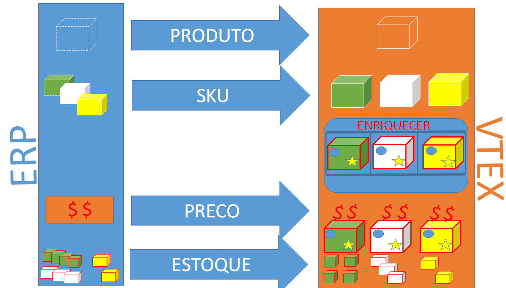

# ERP - Integração Rápida de Catálogo e Condições Comerciais com a VTEX #

Este documento tem por objetivo auxiliar o integrador na integração de catálogo, condição comercial(preço e estoque) do ERP para a uma loja hospedada na versão smartcheckout da VTEX, de uma maneira rápida. Nesse tipo de integração a adminstração da loja está no admin da VTEX, sendo o ERP apenas uma fonte de onde nascem os produstos e SKUs.

##1 - Catalogo Fluxo Básico (Express)##
Nesse cenário de fluxo básico, apenas os dados básicos de produtos e SKUs são manipulados pelo ERP, e todo o enriquecimento (marca, fornecedor, imagens, categoria, ativação, etc...) será feito pelo admin da loja na plataforma VTEX.

Para o ERP integrar se ao catálogo da loja na VTEX, deverá usar o webservice da própria loja, que por definição atenderá em [https:webservice-nomedaloja-vtexcommerce.com.br/service.svc?wsdl](https:webservice-nomedaloja-vtexcommerce.com.br/service.svc?wsdl "web service da loja"). As credenciais de acesso ao webservice deverão ser solicitadas junto ao administrador da loja.

Futuramente além do serviço SOAP (webservice) estaremos também oferecendo integração de catálogo por APIs REST (JSON) bem definidas e de alta performance.

###1.1 - Organização dos Produtos Dentro da Loja###

Geralmente, os produtos são organizados dentro da loja em estruturas mercadológicas formadas por:

1. **Departamento** - categoria cujo id de categoria pai é **nulo**, 
2. **Categoria** - categoria cujo id de categoria pai é um **departamento**,
3. **SubCategoria**. categoria cujo id de categoria pai é um **categoria**

*Exemplo:*  
*Departamento/Categoria/SubCategoria/Produto*  
*Ferramentas/Eletricas/Furradeiras/Super Drill*  

O cadastro da estrutura mercadologica deve ser feito diretamente no admin da própria loja (_http://sualoja.com.br/admin/Site/Categories.aspx_), e para atender a integração vinda do ERP, é criado um departamento padrão para produtos que vem do ERP, ou seja, todos os produtos caem no admin da loja nesse departamento padrão, e depois no momento do enriquecimento é colocado na categoria desejada.

###1.2 - Produtos e SKUs###

Qual é a diferença entre produto e SKU?

**Produto** é uma definição mais genérica de algo que é ofertado ao cliente. 

*Exemplo: Geladeria, Camiseta, Bola*
 

**SKU** é uma sigla em ingles de "Stock Keeping Unit", em português Unidade de Manutenção de Estoque,
ou seja, uma SKU define uma variação de um produto.

*Exemplo: Geladeira Branca 110V, Camiseta Amarela Grande*

No modelo de cadastro de Produtos e SKUs da VTEX, um SKU sempre será filha de um Produto (não existe SKU sem produto), mesmo que esse produto não tenha variçãoes, e nesse caso será 1 SKU para 1 produto.

*Exemplo: Produto Bola Jabulani com a SKU Bola Jabulani*

###1.3 - Integração de Produtos e SKUs###

Após definida as variações e a estrutura mecadológica da loja, o próximo passo é enviar os produtos e as SKUs do ERP para a loja VTEX.

###Produto###

Exemplo de request para inserir Produto pelo webservice.

_request:_

	<soapenv:Envelope xmlns:soapenv="http://schemas.xmlsoap.org/soap/envelope/" xmlns:tem="http://tempuri.org/" xmlns:vtex="http://schemas.datacontract.org/2004/07/Vtex.Commerce.WebApps.AdminWcfService.Contracts" xmlns:arr="http://schemas.microsoft.com/2003/10/Serialization/Arrays">
	   <soapenv:Header/>
	   <soapenv:Body>
	      <tem:ProductInsertUpdate>
	         <tem:productVO>
	            <vtex:BrandId>2000011</vtex:BrandId> //id da marca
	            <vtex:CategoryId>1000020</vtex:CategoryId> //id da categoria
	            <vtex:DepartmentId>1000018</vtex:DepartmentId> //id do departamento
	            <vtex:Description>Vaso de barro vermelho, feito a mão com barro do mar vermelho</vtex:Description> //descrição
	            <vtex:DescriptionShort>Vaso de barro vermelho artesanal</vtex:DescriptionShort> descrição curta
	            <vtex:IsActive>true</vtex:IsActive> // true
	            <vtex:IsVisible>true</vtex:IsVisible> // vai ser visível no site
	            <vtex:KeyWords> Barro, vaso, vermelho</vtex:KeyWords> //palavras chaves
	            <vtex:LinkId>vaso_barro_vermelho</vtex:LinkId> //link do produto na loja
	            <vtex:ListStoreId> //pra qual canal de vendas = loja principal = 1
	               	<arr:int>1</arr:int> 
		       		<arr:int>2</arr:int>
	            </vtex:ListStoreId>
	            <vtex:MetaTagDescription>Vaso de barro vermelho, feito a mão com barro do mar vermelho</vtex:MetaTagDescription>
	            <vtex:Name>Vaso Artesanal de Barro Vermelho</vtex:Name> //nome
	             <vtex:RefId>1234567890</vtex:RefId> //id do produto no ERP
	            <vtex:Title>Vaso Artesanal de Barro Vermelho</vtex:Title>
	         </tem:productVO>
	      </tem:ProductInsertUpdate>
	   </soapenv:Body>
	</soapenv:Envelope>

_response:_

	<s:Envelope xmlns:s="http://schemas.xmlsoap.org/soap/envelope/">
	   <s:Body>
	      <ProductInsertUpdateResponse xmlns="http://tempuri.org/">
	         <ProductInsertUpdateResult xmlns:a="http://schemas.datacontract.org/2004/07/Vtex.Commerce.WebApps.AdminWcfService.Contracts" xmlns:i="http://www.w3.org/2001/XMLSchema-instance">
	            <a:AdWordsRemarketingCode i:nil="true"/>
	            <a:BrandId>2000011</a:BrandId>
	            <a:CategoryId>1000020</a:CategoryId>
	            <a:DepartmentId>1000018</a:DepartmentId>
	            <a:Description>Vaso de barro vermelho, feito a mão com barro do mar vermelho</a:Description>
	            <a:DescriptionShort>Vaso de barro vermelho artesanal</a:DescriptionShort>
	            <a:Id>31018369</a:Id>
	            <a:IsActive>false</a:IsActive>
	            <a:IsVisible>true</a:IsVisible>
	            <a:KeyWords>Barro, vaso, vermelho</a:KeyWords>
	            <a:LinkId>vaso_barro_vermelho</a:LinkId>
	            <a:ListStoreId xmlns:b="http://schemas.microsoft.com/2003/10/Serialization/Arrays">
	               <b:int>1</b:int>
	               <b:int>2</b:int>
	            </a:ListStoreId>
	            <a:LomadeeCampaignCode i:nil="true"/>
	            <a:MetaTagDescription>Vaso de barro vermelho, feito a mão com barro do mar vermelho</a:MetaTagDescription>
	            <a:Name>Vaso Artesanal de Barro Vermelho</a:Name>
	            <a:RefId>1234567890</a:RefId>
	            <a:ReleaseDate i:nil="true"/>
	            <a:ShowWithoutStock>true</a:ShowWithoutStock>
	            <a:SupplierId i:nil="true"/>
	            <a:TaxCode i:nil="true"/>
	            <a:Title>Vaso Artesanal de Barro Vermelho</a:Title>
	         </ProductInsertUpdateResult>
	      </ProductInsertUpdateResponse>
	   </s:Body>
	</s:Envelope>

###SKU###

Uma vez inseridos todos os produtos, que teoricamente são os pais das SKUs, chegou o momento de enviar as SKUs. Exemplo dos request para inserir uma SKU na VTEX no webservice.

_request:_  

	<soapenv:Envelope xmlns:soapenv="http://schemas.xmlsoap.org/soap/envelope/" xmlns:tem="http://tempuri.org/" xmlns:vtex="http://schemas.datacontract.org/2004/07/Vtex.Commerce.WebApps.AdminWcfService.Contracts">
	   <soapenv:Header/>
	   <soapenv:Body>
	      <tem:StockKeepingUnitInsertUpdate>
	         <tem:stockKeepingUnitVO>
	            <vtex:CubicWeight>100</vtex:CubicWeight>
	            <vtex:Height>15</vtex:Height>
	            <vtex:IsActive>true</vtex:IsActive>
	            <vtex:IsAvaiable>true</vtex:IsAvaiable>
	            <vtex:IsKit>false</vtex:IsKit>
	            <vtex:Length>15</vtex:Length>
				<vtex:ListPrice>150.0</vtex:ListPrice> **/ler obs
	            <vtex:ModalId>1</vtex:ModalId>
	            <vtex:ModalType>Vidro</vtex:ModalType>
	            <vtex:Name>Vaso Artesanal de Barro Vermelho Escuro </vtex:Name>
   				<vtex:Price>110.0</vtex:Price> **/ler obs
	            <vtex:ProductId>31018369</vtex:ProductId>
	            <vtex:RealHeight>17</vtex:RealHeight>
	            <vtex:RealLength>17</vtex:RealLength>
	            <vtex:RealWeightKg>10</vtex:RealWeightKg>
	            <vtex:RealWidth>17</vtex:RealWidth>
	            <vtex:RefId>00123456</vtex:RefId>
	            <vtex:RewardValue>0</vtex:RewardValue>
	            <vtex:StockKeepingUnitEans>
	               <vtex:StockKeepingUnitEanDTO>
	                  <vtex:Ean>0123456789123</vtex:Ean>
	               </vtex:StockKeepingUnitEanDTO>
	            </vtex:StockKeepingUnitEans>
	            <vtex:UnitMultiplier>1</vtex:UnitMultiplier>
	            <vtex:WeightKg>9</vtex:WeightKg>
	            <vtex:Width>15</vtex:Width>
	         </tem:stockKeepingUnitVO>
	      </tem:StockKeepingUnitInsertUpdate>
	   </soapenv:Body>
	</soapenv:Envelope>

_response:_
	
	<s:Envelope xmlns:s="http://schemas.xmlsoap.org/soap/envelope/">
	   <s:Body>
	      <StockKeepingUnitInsertUpdateResponse xmlns="http://tempuri.org/">
	         <StockKeepingUnitInsertUpdateResult xmlns:a="http://schemas.datacontract.org/2004/07/Vtex.Commerce.WebApps.AdminWcfService.Contracts" xmlns:i="http://www.w3.org/2001/XMLSchema-instance">
	            <a:CommercialConditionId i:nil="true"/>
	            <a:CostPrice>1</a:CostPrice>
	            <a:CubicWeight>100</a:CubicWeight>
	            <a:DateUpdated>2014-10-29T19:03:17.718427</a:DateUpdated>
	            <a:EstimatedDateArrival i:nil="true"/>
	            <a:Height>15</a:Height>
	            <a:Id>31018371</a:Id>
	            <a:InternalNote i:nil="true"/>
	            <a:IsActive>false</a:IsActive>
	            <a:IsAvaiable>false</a:IsAvaiable>
	            <a:IsKit>false</a:IsKit>
	            <a:Length>15</a:Length>
	            <a:ListPrice>150.0</a:ListPrice>
	            <a:ManufacturerCode i:nil="true"/>
	            <a:MeasurementUnit>un</a:MeasurementUnit>
	            <a:ModalId>1</a:ModalId>
	            <a:ModalType>Vidro</a:ModalType>
	            <a:Name>Vaso Artesanal de Barro Vermelho Escuro</a:Name>
	            <a:Price>110.0</a:Price>
	            <a:ProductId>31018369</a:ProductId>
	            <a:ProductName>Vaso Artesanal de Barro Vermelho</a:ProductName>
	            <a:RealHeight>17</a:RealHeight>
	            <a:RealLength>17</a:RealLength>
	            <a:RealWeightKg>10</a:RealWeightKg>
	            <a:RealWidth>17</a:RealWidth>
	            <a:RefId>00123456</a:RefId>
	            <a:RewardValue>0</a:RewardValue>
	            <a:StockKeepingUnitEans>
	               <a:StockKeepingUnitEanDTO>
	                  <a:Ean>0123456789123</a:Ean>
	               </a:StockKeepingUnitEanDTO>
	            </a:StockKeepingUnitEans>
	            <a:UnitMultiplier>1</a:UnitMultiplier>
	            <a:WeightKg>9</a:WeightKg>
	            <a:Width>15</a:Width>
	         </StockKeepingUnitInsertUpdateResult>
	      </StockKeepingUnitInsertUpdateResponse>
	   </s:Body>
	</s:Envelope>

**obs= O preço da SKU pode não ser enviado no momento da inserção da SKU. Quando um preço não é enviado no momento da criação de uma SKU, na tabela d SKU por obrigatoriedade é criado um preço fictício de 99999.00, e no sistema de "Pricing" da VTEX não é inserido o preço.

##2 - Preço e Estoque##
Uma vez cadastradas os produtos e as SKUs na loja da VTEX, é necessário alimentar o estoque e acertar o preço na tabela de preço (se no momento de inserir a SKU não enviou o preço).

####2.1 - Preço ####
Se no momento sa inserção da SKU não foi enviado um preço válido para a SKU é necessário inserir o preço da mesma. Isso pode ser feito direto no admin da loja na VTEX (_urldaloja/admin/Site/SkuTabelaValor.aspx_), ou usando a API REST do sistema de **Pricing**.

O primeiro passo a ser tomado para acessar as APIs da VTEX é solicitar os token de acesso (X-VTEX-API-AppToken e X-VTEX-API-AppKey) ao administrador da loja. Após isso fazer um POST como segue o exemplo:

endpoint: **http://sandboxintegracao.vtexcommercebeta.com.br/api/pricing/pvt/price-sheet**  
verb: **POST**  
Content-Type: **application/json**  
Accept: **application/json**

*Exemplo do POST:* 

	[
	  	{
	    	"Id": null, //caso saiba o id que vai alterar, preencher
	    	"itemId": 11, //id do sku que deseja manipular
	    	"salesChannel": 1, //canal de vendas onde vai vender
	    	"price": 241.0, // preço por
	    	"listPrice": 239.0, //preço de
	    	"validFrom": "2013-12-05T17:00:03.103", //data validade de
	    	"validTo": "2113-12-05T17:00:03.103" //data de validade até
	  	},
	  	{
	    	"Id": null,
	    	"itemId": 2000014472,
	    	"salesChannel": 1,
	    	"price": 2.5,
	    	"listPrice": 15.0,
	    	"validFrom": "2011-03-04T00:00:00",
	    	"validTo": "2015-03-28T00:00:00"
	  	}
	]

A documentação completa sobre a API de **Pricing** se encontra em:
http://lab.vtex.com/docs/logistics/api/latest/carrier/index.html

####2.2 - Estoque ####
Isso pode ser feito direto no admin da loja na VTEX (_urldaloja/admin/logistics/#/dashboard_), maneira rápida:

1. Criar o estoque,  
2. Criar a transpotadora,  
3. Criar a doca,
4. Colocar estoque nos itens  

Manipulando estoque através da API REST do sistema de **Logistics**:

Criar o estoque, criar a transpotadora e criar a doca no admin da VTEX, 
e depois usar a API REST do **Logistics** para manipular o estoque, como segue exemplo:

endpoint: **http://sandboxintegracao.vtexcommercebeta.com.br/api/logistics/pvt/inventory/warehouseitems/setbalance**    
verb: **POST**    
Content-Type: **application/json**    
Accept: **application/json**    

*Exemplo do POST:* 

	[
  		{
    		"wareHouseId": "1_1", //id do estoque
    		"itemId": "12", //id do sku que vai manipular
    		"quantity": 100 //quantidade do estoque que deseja atualizar
  		},
	  	{
	    	"wareHouseId": "1_1",
	    	"itemId": "45",
	    	"quantity": 8
	  	},
	  	{
	    	"wareHouseId": "1_2",
	    	"itemId": "45",
			"quantity": 5
	  	}
	]

A documentação completa sobre a API de **Logistics** se encontra em:
_http://lab.vtex.com/docs/logistics/api/latest/carrier/index.html_

##3 - Considerações ##

####3.1 - Uso do webservice ####
O webservice VTEX deve ser usado o mínimo possível para os processo de integração, hoje com excessão do **Catalogo**, que está com sua API REST em desenvolvimento, todos os outros módulos da VTEX possúem APIs REST bem definidas e de alta performance. É altamente recomendado que se use as APIs REST nos módulos que não seja o **Catalog**

####3.2 APIs REST (formato JSON) ####

As APIs REST deve ser usada sempre que possível, pois ela é muito melhor do que o webservice, pois é mais performática e é muito mais completa em dados. Documentação de todas as **APIs VTEX** está em:
_http://lab.vtex.com/docs/_

####3.3 Pooling (loop de atualização executado de tempos em tempos) ####
O envio ou consumo de dados num processo de integração deve ser executado somente quando necessário, ou seja, o dado só deve ser enviado do ERP para a plataforma VTEX quando ele realmente for alterado. **NÂO** se deve fazer uma integração que varre entidades inteiras do ERP e atualiza todos os dados na plataforma VTEX de tempos  em tempos. Além de consumir e processar dados desnecessáriamente, isso não funcionaria para lojas com mais de 5 mil Skus no catálogo.

####3.4 Integração Completa ####
A integração completa se aplica quando o cliente já pussui o ERP com a estrutura mercadologica definida, assim como as marcas, produtos e SKUs e usa esse ERP antes de possuir o comércio eletrônico.  
A integração completa demanda mais tempo, pois envolve mais interfaces, e deve seguir as mesmas boas práticas da integração expressa, ou seja, usar o web service somente para os recursos do **Catalog**(documentação completa do webservice: _https://github.com/vtex/vcs.integration.sampleshttps://github.com/vtex/vcs.integration.samples_), os outros recursos devem ser atualizados usando **API REST** dos módulos.

####3.5 Pedidos e Tracking ####
Toda a integração de pedidos, assim como atualizações de Notas Fiscais e Tracking devem ser feitas pela API REST do OMS (Order Managment System) da VTEX.  Um outro documento parecido com esse está sendo desenvolvido para citar a integração de pedidos e tracking.

Segue o link da API completa do OMS: _http://docs.vtex.com.br/pt-br/oms/api/orders/_ 

####3.6 Ferramentas de apoio ao integrador ####
Recomendamos algumas ferramentas que são de extrema importância para qualquer integrador:

**soapUI 3.6.1** (_http://www.soapui.org/Downloads/older-versions.html_)
Está ferramente é muito importante no processo de integração, pois ela permite simular os metodos do webservice, gerando automaticamente o request XML. Nesta ferramenta pode fazer as chamdas para as APIs REST também.

**Postman - REST Client** (_chrome://extensions/_)
Nesta ferramente pode se testar, armazenar histórico, salvar coleções de requests do acesso de todas as APIs dos modulos VTEX  (OMS, Logistics, Pricing, GCS, etc).  

É de suma importancia que o integrador tenha o conhecimento de ferramentas desse tipo, ou outras parecidas, antes de inciar um processo de integração usando webservice SOAP ou APIs REST VTEX.

####3.7 Header nas Chamadas a API REST####
Toda chamada as API REST devem conter no Headear as seguintes Keys:  
X-VTEX-API-AppToken:**[Value]**  
X-VTEX-API-AppKey:**[Value]**  
Content-Type: **application/json**      
Accept: **application/json**   

####3.8 Versão:Beta 1.2####
Essa versão de documntação suporta a integração na versão da plataforma VTEX smartcheckout. Ela foi escrita para auxiliar um integração e a idéia e que através dela, não  restem nenhuma dúvida de como se integrar com a VTEX. Se recebeu essa documentação e ainda restaram dúvidas, por favor, detalhe as suas dúvidas abaixo no comentário, para chegarmos a um documento rico e funcional.

autor: Jonas Bolognim