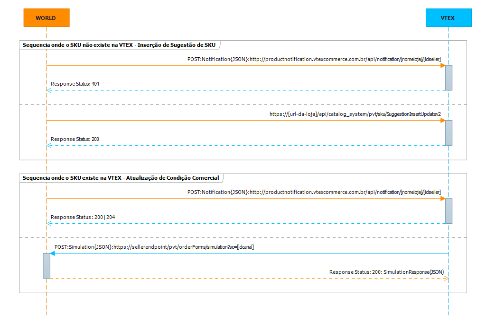

# Inserção de Sugestão de SKU e Atualização de Condição Comercial de SKU 

Este documento tem por objetivo auxiliar na integração e atualização de condição comercial (preço, estoque, frete, SLAs de entrega) de um SKU entre um Seller não VTEX  para uma loja hospedada na versão smartcheckout da VTEX.

*Fluxo de Sugestão de SKU:*

##1 - Inserção de Sugestão de SKU - Fluxo##
Toda vez que houver uma inserção ou alteração na condição comercial de um SKU (preço, estoque, frete e SLAs de entrega) no Seller, se o Seller comercializa essa SKU no marketplace VTEX, o Seller deve enviar uma notificação de mudança de SKU para a VTEX, caso a VTEX retorne em seu serviço o response status 404, significa que a SKU **não existe na VTEX**, então o Seller deve enviar a sugestão de inserção de SKU para a loja da VTEX.

###1.1 - Exemplos de Request de Notificação de Mudança - Endpoint da VTEX###

endpoint: **http://productnotification.vtexcommerce.com.br/api/notification/[nomeloja]/[idseller]**  
verb: **POST**  
Content-Type: **application/json**  
Accept: **application/json**

*Exemplo do Request:*  

	{ 
		"IdSku" : "1634", //id da sku no seller
		"An" : "seller1", //id do seller
		"IdAffiliate":"" // id do afilado, pode ser nulo
	}

###1.2 - Exemplos de Request de Inserção de Sugestão de SKU - Endpoint da VTEX###

endpoint: **https://[url-da-loja]/api/catalog_system/pvt/sku/SuggestionInsertUpdatev2**  
verb: **POST**  
Content-Type: **application/json**  
Accept: **application/json**

*Exemplo do Request:*  

	{
        "Id": null, 
        "CategoryId": 4424, 	//obrigatório, int - id da categoria direta do produto
        "ProductId": null,		
        "ProductName": "Teste de envio de sugestão",	//obrigatório, string
        "ProductDescription": "Uma descrição", 		//string, descrição do produto
        "BrandId": 1,				//obrigatório, int - id da marca/fabricante
        "BrandName": null,		//string, nome da marca
        "SkuId": null,		//obrigatório quando for associação de SKU
        "SkuName": "TESTE NOVO 2013-08-09",	//obrigatório string 
        "SellerId": "nvp", 	//obrigatório, int - sigla do seller
        "ListPrice": 0.0,	//obrigatório, decimal - preço de lista
        "Price": 0.0,	//obrigatório, decimal - preço final
        "Height": 4.0,	//obrigatório, decimal - altura, na ausência informar 1.0
        "Width": 11.0,	//obrigatório, decimal - largura, na ausência informar 1.0
        "Length": 6.0,	//obrigatório, decimal - comprimento, na ausência informar 1.0
        "WeightKg": 60.0,		//obrigatório, decimal - peso, na ausência informar 1.0
        "ModalId": 1,	//num sei
        "RefId": "0x123",	// obrigatório na ausencia do EAN, string - código de referencia
        "EAN": ["ean"],	// obrigatório na ausencia do RefId, string
        "SellerStockKeepingUnitId": "123456790", 	//obrigatório, string - id da SKU do seller
        "IsKit": false, 	//obrigatório, boleana- quando true indica que é ama SKU kit
        "Images": [	//array de imagens
            {
                "ImageUrl": "http://nome-da-loja/arquivos/ids/157676/7898481301708_1000_1000.jpg",
                "ImageName": "7898481301708_1000_1000",
                "FileId": null
            }
        ],
        "SkuSpecifications": [ 	// array de especificações de SKU
           {
              "FieldId":1234,
              "FieldName":"Tamanho",
              "FieldValueIds":[[1],[2]],
              "FieldValues":[["P"],["M"]]
           }
        ],
        "ProductSpecifications": [[ 	// array de especificações de produto
           {
              "FieldId":345,
              "FieldName":"NameField",
              "FieldValueIds":[[1],[2]],
              "FieldValues":[["V"],["T"]]
           }
        ],
        "SkuSupplementaryFields": [		// array de campos suplementares de SKU
           {
              "FieldId":896,
              "FieldName":"NameField",
              "FieldValueIds":[[1],[2]],
              "FieldValues":[["S1"],["S2"]]
           }
        ],
      "CategoryFullPath":"/12/123/345/"	//string, caminho completo da árvore de categorias.
}

##2 - Atualização de Condição Comercial de SKU - Fluxo##
Toda vez que houver uma alteração na condição comercial de um SKU (preço, estoque, frete e SLAs de entrega, o Seller não VTEX deve enviar uma notificação de mudança de SKU para a VTEX, caso a VTEX retorne em seu serviço o response status 200 ou 204, significa que a SKU **existe** na VTEX, então a VTEX vai no Seller consultar as novas condições comerciais oferecidas pelo Seller.

###2.1 - Exemplos de Request de Busca de Condições Comerciais - Endpoint do Seller###

endpoint: **https://sellerendpoint/pvt/orderForms/simulation?sc=5&an=shopfacilfastshop**  
verb: **POST**  
Content-Type: **application/json**  
Accept: **application/json**  
Parametro: **an=shopfacilfastshop** // parametro a ser retornado items.merchantName  
Parametro: **sc=5** // sc é o canal de vendas cadastrado no marketplace, serve para destacar o canal que sta pedido a simulação

*Exemplo do Request:*  

	{
        "postalCode":"22251-030",            //obrigatório se country estiver preenchido, string
        "country":"BRA",                     //obrigatório se postalCode estiver preenchido, string      
        "items": [                           //obrigatório: deve conter pelo menos um objeto item
            {
                "id":"287611",               //obrigatório, string
                "quantity":1,                //obrigatório-quantidade do item a ser simulada, int
                "seller":"seller1"           //sigla do do seller criado no admin // obrigatório, string
            },
            {
                "id":"5837",
                "quantity":5,
                "seller":"seller1"
            }
        ]
    }

*Exemplo do Response:*

	    {
        "items": [                                                     //pode vir um array vazio
            {
                "id": "287611",                                        //obrigatório, string
                "requestIndex": 0,                                     //obrigatório, int - representa a posição desse item no array original (request)
                "price": 7390,                                         //Os dois dígitos menos significativos são os centavos //obrigatório, int
                "listPrice": 7490,                                     //Os dois dígitos menos significativos são os centavos //obrigatório, int
                "quantity": 1,                                         //obrigatório, int
                "seller": "1",                                         //Id do seller cadastrado na loja // obrigatório, string,
            	"merchantName": "shopfacilfastshop",				   //**devolver o parametro an, so deve ser preenchido quando o pagamento for processado no seller.
                "priceValidUntil": "2014-03-01T22:58:28.143"           //data, pode ser nulo
                "offerings":[                                           //Array opcional, porém não pode ser nulo: enviar array vazio ou não enviar a propriedade
                    {
                        "type":"Garantia",                               //obrigatório, string
                        "id":"5",                                       //obrigatório, string
                        "name":"Garantia de 1 ano",                       //obrigatório, string
                        "price":10000                                   //Os dois dígitos menos significativos são os centavos //obrigatório, int
                    },
                    {
                        "type":"Embalagem de Presente",
                        "id":"6",
                        "name":"Embalagem de Presente",
                        "price":250                                       
                    }
                ]
            },
            {
                "id": "5837",
                "requestIndex": 1,
                "price": 890,                                          // Os dois dígitos menos significativos são os centavos
                "listPrice": 990,                                      // Os dois dígitos menos significativos são os centavos
                "quantity": 5,
                "seller": "1",
				"merchantName": "shopfacilfastshop",	
                "priceValidUntil": null
            }
        ],
        "logisticsInfo": [                                            //obrigatório (se vier vazio é considerado que o item não está disponível) -  todos os itens devem ter os mesmos SLAs
            {
                "itemIndex": 0,                                       //obrigatório, int - representa os dados de sla do item de resposta (response)
                "stockBalance": 99,                                   //obrigatório  quando o CEP foi passado no request, estoque, int
                "quantity": 1,                                        //obrigatório quando o CEP foi passado no request, qauntidade pasada no request, int
                "shipsTo": [ "BRA", "USA" ],                          //obrigatório, array de string com as siglas dos países de entrega
                "slas": [                                             //obrigatório quando o CEP foi passado no request. Pode ser um array vazio
                    {
                        "id": "Expressa",                             //obrigatório, id tipo entrega, string
                        "name": "Entrega Expressa",                   //obrigatório, nome do tipo entrega, string
                        "shippingEstimate": "2bd",                    // bd == "business days" //obrigatório, string
                        "price": 1000                                 // Os dois dígitos menos significativos são os centavos, obrigatório, int
                        "availableDeliveryWindows": [                 //opcional, podendo ser um array vazio
                        ]
                    },
                    {
                        "id": "Agendada",
                        "name": "Entrega Agendada",
                        "shippingEstimate": "5d",                     // d == "days, bd == "business days"
                        "price": 800,
                        "availableDeliveryWindows": [
                             {
                                "startDateUtc": "2013-02-04T08:00:00+00:00",       //date, obrigatório se for enviado delivery window
                                "endDateUtc": "2013-02-04T13:00:00+00:00",         //date, obrigatório se for enviado delivery window
                                "price": 0        //int, obrigatório se for enviado delivery window - o valor total da entrega agendada é o valor base mais o valor desse campo
                            },
                        ]
                    }
                ]
            },
            {
                "itemIndex": 1,
                "stockBalance": 1237,
                "quantity": 5,
                "shipsTo": [ "BRA" ],
                "slas": [
                    {
                        "id": "Normal",
                        "name": "Entrega Normal",
                        "shippingEstimate": "5bd",                                  // bd == "business days"
                        "price": 200
                    }
                ]
            }
        ],
        "country":"BRA",                                           //string, nulo se não enviado
        "postalCode":"22251-030"                                   //string, nulo se não enviado    
    }

**somente mandar esse campo quando o pagamento for processado no Seller.

##3 - Considerações##

####3.1 Header nas Chamadas a API REST####
Todas chamadas as API REST devem conter no Headear as seguintes Keys:  
X-VTEX-API-AppToken:**[Value]**  
X-VTEX-API-AppKey:**[Value]**  
Content-Type: **application/json**      
Accept: **application/json**   

####3.2 Ferramentas de apoio ao integrador ####
Ferramentas são de extrema importância para qualquer integrador:

**Postman - REST Client** (_chrome://extensions/_)
Nesta ferramente pode se testar, armazenar histórico, salvar coleções de requests do acesso de todas as APIs dos modulos VTEX  (OMS, Logistics, Pricing, GCS, etc).  

É de suma importancia que o integrador tenha o conhecimento de ferramentas desse tipo, ou outras parecidas, antes de inciar um processo de integração usando APIs REST VTEX.

####3.3 - Glossário####
Seller - Responsável por fazer a entrega do pedido.  
SKU - Define uma variação de um produto.

####3.4 Versão:Beta 1.1####
Essa versão de documentação suporta a integração na versão da plataforma VTEX smartcheckout. Ela foi escrita para auxiliar um integração e a idéia e que através dela, não  restem nenhuma dúvida de como se integrar com a VTEX. Se recebeu essa documentação e ainda restaram dúvidas, por favor, detalhe as suas dúvidas abaixo no comentário, para chegarmos a um documento rico e funcional.

Autor: *Jonas Bolognim*